# WP-0 dependency map for the cubic-fourfold irrationality proof

**Audit date:** 2026-07-29
**Source audited:** Katzarkov--Kontsevich--Pantev--Yu (KKPY), *Birational
Invariants from Hodge Structures and Quantum Multiplication*,
[arXiv:2508.05105v2](https://arxiv.org/abs/2508.05105v2), especially
Theorem 6.8 on printed pp. 69--71.
**Gate status:** **STOP. The proof of Theorem 6.8 has a confirmed gap as
printed.**

This is a verdict on the written proof, not a counterexample to the theorem.
The audit finds four printed defects--an inadmissible evaluation point, a
theorem-hypothesis mismatch, a false rank inequality, and a false surface
paragraph--plus an omitted very-general step and an unverified blowup-to-atom
interface.  Some repairs are immediate and others only plausible.  Therefore
this audit does not certify the headline theorem and does not refute it.

## 1. Scope, source control, and terminology

The target is only

> **Theorem 6.8.** A very general four-dimensional cubic hypersurface in
> \(\mathbf{CP}^{5}\) is not rational.

The map below includes every numbered internal statement actually consumed by
the printed proof, the foundational numbered statements required to interpret
those citations, and every external input on that path.  General material on
motives, other examples, and the finer post-theorem determination of the four
cubic atoms is excluded.  In particular, Proposition 5.28, Lemma 6.11, and
Corollary 6.12 are not premises of Theorem 6.8.

The downloaded official artifacts used for this audit have the following
SHA-256 hashes:

| Artifact | SHA-256 |
|---|---|
| `2508.05105v1.pdf` | `26033f81afa0acd2b97337fa73c74ef49a783897306f2b2a81905ce0ca74f918` |
| `2508.05105v2.pdf` | `2c5c9f0a2f9eaf230605eaf844c3b7d08e0181e6dbc921153156a071d616ff64` |
| v1 TeX source tarball | `33f71f79663de77d5c9d9cbb5eb040648aace3839e9f5e807bf364573c77eeb8` |
| v2 TeX source tarball | `36a6447a2f402dce468e91ca76dd0c5439a14db088c5648431ccfee507bc709e` |

Classification follows the work order:

- **L** -- finite linear/commutative algebra or finite combinatorics;
- **GW** -- Gromov--Witten, quantum, non-archimedean analytic F-bundle, or
  closely coupled symplectic input that must be pinned as an expensive
  interface;
- **H** -- Hodge and lattice theory;
- **B** -- birational geometry;
- **V** -- very-general/countable-union bookkeeping.

The work order has no separate class for non-archimedean analysis.  Such nodes
are placed in **GW** when they form part of the quantum/F-bundle interface;
this does not suggest that they are enumerative statements.

Formalization cost uses this scale:

- **F0:** exact finite calculation, formalizable directly;
- **F1:** standard algebra/topology already close to library mathematics;
- **F2:** substantial classical mathematics with a clean theorem boundary;
- **F3:** deep theorem best introduced as a named, pinned assumption;
- **F4:** current statement is not yet a safe assumption because its exact
  hypotheses, analytic passage, or functoriality still need repair.

## 2. Proof skeleton

For a Noether--Lefschetz-general cubic fourfold \(X\), the printed argument is:

1. The Hodge-invariant cohomology is the five-dimensional ambient space
   \(\langle 1,h,h^2,h^3,h^4\rangle\).
2. Lemma 5.19 says that Euler quantum multiplication has the same *set* of
   eigenvalues on all cohomology as on this invariant subalgebra.
3. Givental's computation, expressed in Example 6.6(iii), gives four
   eigenvalue clusters whose generalized eigenspaces on the five-dimensional
   Hodge-invariant/ambient subspace have dimensions \(2,1,1,1\).
4. Theorem 4.1 is invoked to put every Hodge atom in one cluster, from which
   the paper needs \(\rho_\alpha\leq 2\).
5. The primitive Hodge row \((0,1,20,1,0)\) forces an atom with
   \(\operatorname{Coeff}_{t^2}P_\alpha(t)=1\).
6. Proposition 5.30 reduces irrationality to showing that no point, curve, or
   surface can supply an atom with that coefficient and \(\rho_\alpha\leq2\).
7. Points and curves have no \(t^2\)-part.  A suitable minimal surface with
   \(p_g>0\) has nef canonical class, hence one atom by Lemma 5.24, and that
   atom has at least the three algebraic classes in degrees \(0,2,4\).

Steps 3 and the final finite matrix calculation check out.  Steps 1, 4, 6,
and 7 contain missing or invalid edges detailed below.

## 3. Dependency DAG

```mermaid
flowchart TD
  subgraph cubic["Cubic target"]
    I31["I31 [B/F4] Theorem 6.8"]
    I28["I28 [V/F3] very-general Hodge locus"]
    I29["I29 [H/F2] primitive atom inference"]
    I30["I30 [B/F2] low-dimensional exclusion"]
    I26["I26 [GW/F2] Section 6.1 ODE derivation"]
    I26b["I26b [GW/F2] Remark 6.3(b) ODE"]
    I26c["I26c [L/F1] coefficient-comparison algorithm"]
    I26a["I26a [GW/F2] Example 6.6(iii) matrix"]
    I27["I27 [L/F0] exact characteristic polynomial"]
    I27a["I27a [GW/F4] cluster-to-atom rank step"]
  end

  subgraph atoms["Atoms and Hodge representations"]
    I10["I10 [H/F2] Definition 5.1"]
    I11["I11 [H/F2] Example 5.5"]
    I11a["I11a [GW/F3] p.61 Hodge equivariance"]
    I11b["I11b [H/F2] Example 5.7"]
    I11c["I11c [H/F2] Example 5.6"]
    I12["I12 [GW/F3] Definition 5.10"]
    I12a["I12a [GW/F4] Equation 5.9 fixed loci"]
    I12b["I12b [GW/F4] p.51 fixed-locus geometry"]
    I13["I13 [B/F3] Definition 5.16"]
    I13a["I13a [B/F1] disjoint-union equivalence"]
    I13b["I13b [GW/F4] blowup equivalence"]
    I13c["I13c [GW/F4] projective-bundle equivalence"]
    I13d["I13d [H/F3] p.61 Hodge-atom quotient"]
    I14["I14 [B/F3] Proposition 5.17"]
    I15["I15 [GW/F2] Lemma 5.18"]
    I16["I16 [L/F1] Lemma 5.19"]
    I17["I17 [GW/F2] Definition 5.20"]
    I18["I18 [GW/F3] Definition 5.21"]
    I19["I19 [GW/F4] Proposition 5.22"]
    I20["I20 [H/F4] Proposition 5.23"]
    I21["I21 [H/F2] Lemma 5.24"]
    I22["I22 [H/F2] Lemma 5.25"]
    I22a["I22a [H/F4] p.62 atom representation"]
    I23["I23 [H/F1] Definition 5.26"]
    I24["I24 [H/F1] Remark 5.27"]
    I25["I25 [B/F3] Proposition 5.30"]
  end

  subgraph quantum["Quantum and spectral construction"]
    Ipre1["Ipre1 [GW/F2] Definition 3.1"]
    Ipre2["Ipre2 [GW/F1] Definition 3.3"]
    I00["I00 [L/F1] Definition 3.8"]
    I00a["I00a [L/F1] Lemma 3.9"]
    I00b["I00b [GW/F3] Lemma 3.10"]
    Ipre3["Ipre3 [L/F1] Definition 3.11"]
    Ipre4["Ipre4 [L/F1] Definition 3.12"]
    Ipre4a["Ipre4a [L/F1] Remark 3.13"]
    Ipre5["Ipre5 [GW/F3] Definition 3.22"]
    I01["I01 [GW/F3] Definition 3.25"]
    I02["I02 [GW/F3] Lemma 3.29"]
    I03["I03 [GW/F3] Definition 3.32"]
    I03a["I03a [H/F2] Proposition 3.37"]
    I03b["I03b [GW/F3] Proposition 3.40"]
    I03c["I03c [GW/F3] Definition 3.52"]
    I03d["I03d [GW/F3] Remark 3.53"]
    I04["I04 [GW/F3] Theorem 4.1"]
    I05["I05 [GW/F4] Theorem 4.5"]
    I06["I06 [GW/F1] Lemma 4.6"]
    I07["I07 [B/F1] Lemma 4.7"]
    I08["I08 [GW/F4] Remark 4.10"]
    I09["I09 [GW/F3] Theorem 4.11"]
  end

  subgraph sources["External sources and missing interfaces"]
    E01["E01 [GW/F3] Behrend Theorem 6"]
    E02["E02 [GW/F3] Behrend-Fantechi Def. 5.2, Prop. 5.3"]
    E03["E03 [GW/F3] Kontsevich-Manin Def. 2.2"]
    E04["E04 [GW/F3] Givental Section 9"]
    E05["E05 [GW/F3] HYZZ decomposition/uniqueness"]
    E06["E06 [GW/F3] Iritani Theorem 5.18"]
    E07["E07 [GW/F3] Iritani-Koto Theorem 5.1"]
    E08["E08 [B/F3] AKMW Theorem 0.1.1"]
    E09["E09 [B/F3] Wlodarczyk auxiliary source"]
    E10["E10 [H/F3] Deligne-Milne Theorem 2.11"]
    E11["E11 [H/F3] Milne Section 0.2, Cor. 3.4"]
    E12["E12 [H/F4] missing representation-family lemma"]
    E13["E13 [H/F3] Voisin corrected Torelli theorem"]
    E14["E14 [V/F3] Hassett Theorem 3.1.2"]
    E14H["E14H [H/F2] Hassett Section 2.1 data"]
    E15["E15 [V/F3] CDK alternative repair"]
    E16["E16 [B/F2] Peters Props. 2.2 and 6.2"]
    E18["E18 [GW/F3] Berkovich framework only"]
    E18a["E18a [GW/F4] missing fixed-locus/connectedness theorem"]
    E19["E19 [GW/F3] Thuillier Prop.-Def. 1.2"]
    E20["E20 [H/F3] Andre Theorem 0.3"]
    E21["E21 [H/F2] Murre-Nagel-Peters Def. 1.2.13"]
    E22["E22 [H/F2] Stacks Tags 0FGS/0FFG"]
    E23["E23 [H/F2] Hodge index theorem"]
  end

  I31 --> I28
  I31 --> I27a
  I31 --> I29
  I31 --> I30
  I31 --> I25

  I28 -. "printed insufficient citation" .-> E13
  I28 --> E14
  I28 -. "alternative repair" .-> E15
  I29 --> I28
  I29 --> I24
  I29 --> E14H
  I30 --> I21
  I30 --> I13
  I30 --> I23
  I30 --> I24
  I30 --> E16

  I27a --> I27
  I27a --> I04
  I27a --> I16
  I27a --> I19
  I27a --> I22a
  I27a --> I23
  I27a --> I28
  I27 --> I26a
  I26a --> I26c
  I26c --> I26b
  I26b --> I26
  I26 --> I03
  I26 --> Ipre4a
  I26 --> E04

  I25 --> I14
  I25 --> I13d
  I14 --> I13
  I14 --> E08
  I14 -. "auxiliary citation" .-> E09
  I13 --> I12
  I13 --> I13a
  I13 --> I13b
  I13 --> I13c
  I13a --> Ipre2
  I13a --> I12
  I13b --> I05
  I13b --> I08
  I13b --> I12
  I13b --> I13a
  I13b --> E18a
  I13c --> I09
  I13c --> I12
  I13c --> I13a
  I13c --> E05
  I13c --> E18a
  I13d --> I13
  I13d --> I12
  I13d --> I11
  I13d --> I11a

  I21 --> I15
  I21 --> I11a
  I21 --> I13d
  I15 --> I01
  I15 --> Ipre4a
  I15 --> I13
  I16 --> I00a
  I00a --> I00

  I23 --> I22a
  I23 --> I11b
  I24 --> I23
  I22a --> I22
  I22a --> I20
  I22a --> I18
  I22a --> I19
  I22a --> E12
  I22 --> I11
  I22 --> I03d
  I22 --> I13d
  I22 --> I20
  I20 --> I18
  I20 --> E12
  I19 --> I04
  I19 --> I05
  I19 --> I09
  I19 --> I13
  I19 --> I18
  I19 --> E18a
  I18 --> I17
  I18 --> I12
  I18 --> I04
  I17 --> I00
  I17 --> Ipre4a
  I17 --> I10
  I12 --> I10
  I12 --> I03d
  I12 --> Ipre4a
  I12 --> I12a
  I12 --> I12b
  I12 --> E18
  I12 --> E19
  I12 --> E18a
  I12a --> I03d
  I12a --> E18
  I12a --> E19
  I12b --> I12a
  I12b --> E18a

  I11a --> I03d
  I11a --> I11b
  I11b --> I11
  I11b --> I11c
  I11b --> E20
  I11c --> I10
  I11c --> E20
  I11 --> I10
  I11 --> E10
  I11 --> E11
  I10 --> E20
  I10 --> E21
  I10 --> E22

  I04 --> I00
  I04 --> Ipre1
  I04 --> Ipre2
  I04 --> Ipre4a
  I04 --> E05
  I05 --> I00b
  I05 --> Ipre2
  I05 --> Ipre5
  I05 --> I06
  I05 --> I07
  I05 --> E05
  I05 --> E06
  I08 --> E05
  I08 --> E06
  I09 --> I00b
  I09 --> Ipre2
  I09 --> Ipre5
  I09 --> I06
  I09 --> E07

  I03d --> I03c
  I03c --> I03b
  I03c --> I03
  I03b --> I03a
  I03b --> I01
  I03b --> E20
  I03a --> E20
  I03a --> E23
  I03 --> I02
  I03 --> I00b
  I03 --> Ipre5
  I02 --> I01
  I01 --> E01
  I01 --> E02
  I01 --> E03
  I01 --> E21
  I01 --> E22
  Ipre5 --> Ipre1
  Ipre5 --> E01
  Ipre5 --> E02
  Ipre5 --> E03
  Ipre5 --> E21
  Ipre5 --> E22
  I00b --> I00
  I00b --> Ipre1
  I00 --> Ipre1
  Ipre4a --> Ipre4
  Ipre4 --> Ipre3
  Ipre3 --> I00a
  Ipre3 --> Ipre1
```

Solid arrows mean “requires.” Dashed arrows mark a printed but insufficient
citation, auxiliary support, or an explicitly non-consumed alternative repair. Every
box has exactly one ledger ID, one work-order class, and one cost. E18a is not
a publication: it records the theorem the proof needs but no cited source
currently supplies.

## 4. Internal node ledger

### 4.1 Quantum and spectral construction

| ID | v2 node and location | Class | Cost | Exact role and audit status |
|---|---|---:|---:|---|
| Ipre1 | Definition 3.1, p. 17 | GW | F2 | Defines a non-archimedean analytic F-bundle and its meromorphic connection. This is the ambient object in Theorems 4.1, 4.5, and 4.11 and in the atom construction. |
| Ipre2 | Definition 3.3, p. 19 | GW | F1 | Defines the external sum of F-bundles. The spectral, blowup, and projective-bundle decompositions all use this operation. |
| I00 | Definition 3.8, p. 20 | L | F1 | Defines maximality at a point by requiring evaluation on a cyclic vector to identify the base tangent space with the F-bundle fiber. It makes the dimension obstruction in Section 7.2 immediate. |
| I00a | Lemma 3.9, p. 20 | L | F1 | Shows that an overmaximal fiber is a free rank-one module over a unital commutative associative superalgebra. This supplies the algebra to which Lemma 5.19 is applied. |
| I00b | Lemma 3.10, p. 20 | GW | F3 | Says an overmaximal F-bundle is locally pulled back from a maximal bundle on a transverse slice to the redundancy foliation. Theorem 4.5 invokes this quotient step when passing to maximal analytic bundles. |
| Ipre3 | Definition 3.11, p. 21 | L | F1 | Transfers the fiber multiplication of a maximal F-bundle to the Frobenius product on the tangent sheaf. |
| Ipre4 | Definition 3.12, p. 21 | L | F1 | Defines the Euler field of a maximal F-bundle and the residual endomorphism \(\kappa\). This is the operator whose spectrum drives every later decomposition. |
| Ipre4a | Remark 3.13, p. 21 | L | F1 | Identifies \(\kappa=\mathrm{Eu}\circ(-)\) on the \(u=0\) fiber. This is the exact bridge from the abstract residual endomorphism to the cubic quantum-multiplication matrix. |
| Ipre5 | Definition 3.22, p. 27 | GW | F3 | Defines the formal logarithmic A-model F-bundle. Theorems 4.5 and 4.11 compare analytic F-bundles with Iritani's and Iritani--Koto's formal quantum D-modules, so this formal object is on the blowup/projective-bundle path. |
| I01 | Definition 3.25, p. 29 | GW | F3 | Defines the genus-zero potential over the completed effective-curve monoid algebra. It depends on the virtual class and GW axioms. |
| I02 | Lemma 3.29, p. 30 | GW | F3 | Claims the potential is analytic on the non-archimedean ample tube. The open-tube definition is decisive for the invalid choice \(q=1\). |
| I03 | Definition 3.32, p. 31 | GW | F3 | Defines the overmaximal and maximal analytic A-model F-bundles. The full base has tangent dimension equal to the cohomology rank. |
| I03a | Proposition 3.37, pp. 33--34 | H | F2 | Shows that the algebraic/transcendental decomposition of \(H^2\) is stable under the motivic symmetry group. Its \(K=\mathbf C\), Hodge-group specialization is the stability input for the Hodge-equivariant base; the general Galois-action clause is not needed for the cubic target. |
| I03b | Proposition 3.40, pp. 35--36 | GW | F3 | Proves motivic equivariance of the quantum product by realizing GW classes as motivated cycles. Restriction from the motivic group to the Hodge group supplies the numbered support for the “by construction” assertion I11a. The primary cost is the GW-to-motive interface; the target representation is Hodge-theoretic. |
| I03c | Definition 3.52, p. 42 | GW | F3 | Packages the general \(G\)-equivariant analytic A-model F-bundle. Section 5.4 literally cites Definition 3.32 for \(K=\mathbf C\); this stronger construction is the paper's numbered route to the equivariance asserted at I11a. |
| I03d | Remark 3.53, p. 42 | GW | F3 | Base-changes I03c to an algebraically closed Puiseux field. It supplies the paper's base-field bookkeeping for Hodge atoms, though it does not prove the later base-change-of-invariants claim. The intervening Galois-twist Lemmas 3.47 and 3.50 are vacuous for \(K=\mathbf C\). |
| I04 | Theorem 4.1, p. 43 | GW | F3 | Splits an F-bundle locally by disjoint Euler spectra. It explicitly assumes that the F-bundle is maximal at the chosen point. Theorem 6.8 applies it after a non-maximal restriction. |
| I05 | Theorem 4.5, pp. 45--47 | GW | F4 | Claims a canonical analytic F-bundle isomorphism between a blowup and the external sum of the original variety with \(r-1\) copies of the center. This is the principal input to atom additivity. |
| I06 | Lemma 4.6, p. 45 | GW | F1 | Laurent-series convergence criterion on an annulus times a polydisk. It is elementary, but belongs to the non-archimedean analytic interface rather than the work order's finite-algebra class. Used to pass formal changes of variables to analytic domains. |
| I07 | Lemma 4.7, p. 46 | B | F1 | Embeds the effective cone of the blowup in a cone generated by shifted base classes and the exceptional-line class. |
| I08 | Remark 4.10, p. 47 | GW | F4 | New in v2. Asserts uniqueness from algebraic initial conditions, later used to claim \(G\)-equivariance of blowup decompositions. The required equivariant and fixed-locus consequences are not themselves stated as a theorem. |
| I09 | Theorem 4.11, p. 47 | GW | F3 | Identifies the projective-bundle F-bundle with \(r\) external copies of the base F-bundle on analytic domains. Used to make \(\mathrm{CF}(\mathbf P^4)=5\,\mathrm{CF}(\mathrm{pt})\). |

### 4.2 Atoms and Hodge representations

| ID | v2 node and location | Class | Cost | Exact role and audit status |
|---|---|---:|---:|---|
| I10 | Definition 5.1, p. 48 | H | F2 | Defines a \((G,\epsilon_G)\)-symmetric Weil cohomology theory. |
| I11 | Example 5.5, p. 49 | H | F2 | Chooses the universal Hodge symmetry pair and folded rational Betti cohomology. |
| I11a | unnumbered Hodge-equivariance assertion, p. 61 | GW | F3 | The Hodge-atom specialization says that the Definition 3.32 A-model F-bundle is Hodge-equivariant “by construction.” The direct target-specific justification is that every GW class is algebraic and hence fixed by the Hodge group after Tate periodization; contraction with the Hodge-invariant Poincare pairing makes the product, Euler field, and connection equivariant. This expensive GW-to-Hodge interface should be isolated as a pinned lemma. Proposition 3.40 and Definition 3.52 provide the paper's stronger numbered route. |
| I11c | Example 5.6, p. 49 | H | F2 | Defines the motivated symmetry pair \((\mathsf{MotM},\epsilon_{\mathsf{MotM}})\) from the Tannakian category of pure motivated motives. It is the target group in Example 5.7's comparison. |
| I11b | Example 5.7, p. 49 | H | F2 | States \(\mathbf Z/2\subset\mathsf{Hod}\subset\mathsf{MotM}\) over \(\mathbf Q\) and, after base change, \((\mathbf Z/2)_{\mathbf C}\subset\mathsf H_{\mathrm{gr},\mathbf C}\subset\mathsf{Hod}_{\mathbf C}\subset\mathsf{MotM}_{\mathbf C}\). Restriction from motivated to Hodge symmetry supports I11a; the grading-group inclusion is used by Definition 5.26. |
| I12 | Definition 5.10, p. 51 | GW | F3 | Defines local atoms as connected components of the unramified reduced spectral cover over the fixed locus, with covering-degree multiplicity. The topology of these non-archimedean analytic components matters essentially. |
| I12a | equation (5.9) and preceding assertion, p. 51 | GW | F4 | Claims that the fixed points in the A-model base for \(G(k)\), \(G_{\mathbb K}^{\beth}\), and the analytic group germ are equal. No exact reductive/non-archimedean fixed-point theorem is cited. This equality determines the base used in I12. |
| I12b | unnumbered assertion after (5.9), p. 51 | GW | F4 | Claims that \(B_X^G\) is purely even, connected, closed, and smooth. Evenness and linear closedness are plausible from the representation, but connectedness and smoothness are consumed later and not separately proved or pinned. |
| I13 | Definition 5.16, p. 54 | B | F3 | Defines global atoms by imposing disjoint-union, blowup, and projective-bundle equivalences. Its well-definedness consumes I05 and I09. |
| I13a | unnumbered disjoint-union elementary equivalence, Section 5.2.3, p. 51 | B | F1 | Identifies the local-atom components of a disjoint union and declares the induced elementary equivalence. This supplies the copies of the center and the decomposition of \(\mathbf P^4\) into point atoms. |
| I13b | unnumbered blowup elementary equivalence, Section 5.2.4, pp. 52--53, especially (5.11)--(5.15) | GW | F4 | Uses I05 and equivariance/connectedness claims to relate global connected components, covering degrees, and representations for a blowup and the original plus center copies. This is the main high-risk bridge isolated in Section 7.6. |
| I13c | unnumbered projective-bundle elementary equivalence, Section 5.2.5, p. 54 | GW | F4 | Asserts an analogous connected-domain/component correspondence between \(\mathbf P(\mathcal E)\) and \(r\) copies of the base using I09 and HYZZ Section 5. The global component-control step is compressed to “again” and is not independently pinned. |
| I13d | unnumbered Hodge-atom specialization and quotient, p. 61 | H | F3 | Specializes \(G\)-atoms to \((\mathsf{Hod},\epsilon_{\mathsf{Hod}})\), fixes Betti cohomology and the Puiseux field, and defines \(\mathsf{HAtoms}\) as the quotient by the three elementary equivalences. Lemmas 5.24--5.25 and Proposition 5.30 use this specialization. |
| I14 | Proposition 5.17, p. 54 | B | F3 | If a \(d\)-fold has an atom not obtainable in dimension \(\le d-2\), weak factorization obstructs rationality. |
| I15 | Lemma 5.18, p. 56 | GW | F2 | Uses virtual-dimension triangularity to claim that nef \(K_X\) forces the Euler action to have one eigenvalue and then concludes, through the global-atom definition I13, that the atomic composition has one atom. The degree-to-spectrum argument is short but must be reconstructed exactly. |
| I16 | Lemma 5.19, p. 57 | L | F1 | For multiplication by a \(G\)-fixed element in a finite-dimensional commutative superalgebra, the reduced spectrum on the whole algebra equals that on invariants. The proof is finite algebra and appears sound. |
| I17 | Definition 5.20, p. 58 | GW | F2 | Defines a \(G\)-atomic analytic F-bundle; maximality is part of the definition. |
| I18 | Definition 5.21, p. 59 | GW | F3 | Defines geometric atomic F-bundles and their equivariant equivalence along a connected non-archimedean spectral-cover component. The primary difficulty is analytic/spectral; Hodge atoms specialize the group. |
| I19 | Proposition 5.22, pp. 59--60 | GW | F4 | Sends global atoms to geometric atomic F-bundles, invoking Theorems 4.1, 4.5, and 4.11. Its opening construction correctly refers to the full germ \((B_X,b)\), which suggests but does not supply the missing repair in Theorem 6.8. |
| I20 | Proposition 5.23, p. 60 | H | F4 | Claims the fiber representation is independent of the representative, using rigidity of reductive-group representations. Its cited proposition does not state the required analytic-family local constancy, so this is not yet a safe pinned lemma. |
| I21 | Lemma 5.24, p. 61 | H | F2 | Hodge specialization of I15: a connected smooth projective variety with nef canonical class has one Hodge atom. |
| I22 | Lemma 5.25, pp. 61--62 | H | F2 | Descends the **whole cohomology fiber** to a finite-dimensional \(\overline{\mathbf Q}\)-linear Hodge-group representation independent of the point; its proof calls this a special case of I20 and therefore inherits that rigidity gap. It does not by itself descend an atom's generalized-eigenspace subrepresentation. |
| I22a | unnumbered atom-representation passage after Lemma 5.25, p. 62 | H | F4 | Assigns a subrepresentation \(E^\alpha\) to a generalized-eigenspace subbundle and asserts independence of the atom representative. This consumes Proposition 5.23 and needs the missing analytic-family/local-constancy argument recorded at E12. |
| I23 | Definition 5.26, p. 62 | H | F1 | Defines \(\rho_\alpha\) and the Hodge polynomial \(P_\alpha(t)\). |
| I24 | Remark 5.27, p. 62 | H | F1 | Identifies the coefficient of \(t^k\) with the sum of Hodge pieces having \(p-q=k\) when the representation descends from a rational Hodge structure. |
| I25 | Proposition 5.30, p. 63 | B | F3 | Hodge specialization of Proposition 5.17; it is the final birational obstruction invoked in Theorem 6.8. |

### 4.3 Cubic-specific nodes

| ID | v2 node and location | Class | Cost | Exact role and audit status |
|---|---|---:|---:|---|
| I26 | unnumbered small-F-bundle/Givental setup, Section 6.1, pp. 64--66 | GW | F2 | Restricts the A-model bundle to ambient cohomology, writes its \((q,u)\)-connection with operators \(A\), \(K=(N-d_{\mathrm{tot}})A\), and \(G\), and imports Givental's horizontal solution and scalar ODE. |
| I26b | Remark 6.3(b), p. 66 | GW | F2 | Rewrites Givental's scalar differential equation from \((t,\hbar)\) to the paper's \((q,u)\) variables as equation (6.4). This is the exact ODE fed to the coefficient-comparison algorithm. |
| I26c | unnumbered diagonal-jump coefficient-comparison algorithm, Section 6.1, pp. 66--67 | L | F1 | Uses the diagonal-jump shape and second horizontality equation to eliminate coordinates, then compares the resulting scalar ODE with I26b. Once the GW equation is pinned, solving for the finitely many matrix entries is elementary algebra. |
| I26a | Example 6.6(iii), p. 68 | GW | F2 | States the ambient \(5\times5\) matrices for multiplication by \(h\), \(c_1(T_X)=3h\), and grading. The replay below checks the characteristic polynomial of the stated Euler matrix. |
| I27 | audit extension of the p. 70 \(q=1\) calculation | L | F0 | Page 70 prints \(\lambda^5-3^6\lambda^2\) only at \(q=1\). Applying the same determinant to Example 6.6's general-\(q\) matrix gives \(\chi_{K(q)}(\lambda)=\lambda^2(\lambda^3-3^6q)\). |
| I27a | unnumbered cluster-to-atom/rank inference, p. 70 | GW | F4 | Applies Theorem 4.1 after restricting to the Hodge-fixed base, asserts that every global atom lies in one of the four local clusters, and bounds its Hodge-invariant rank. The restriction is not maximal, the global refinement is unstated, and the printed minimum inequality is false. |
| I28 | unnumbered Noether--Lefschetz assertion, p. 69 | V | F3 | Says the rational Hodge classes are exactly \(1,h,\ldots,h^4\) for the chosen cubic and upgrades that choice to “very general.” The paper cites Voisin only for existence and omits the countable-Hodge-locus step. The primary ledger class is V; its content is Hodge-theoretic. |
| I29 | unnumbered primitive-atom inference, p. 70 | H | F2 | The primitive Hodge row \((0,1,20,1,0)\), together with compatibility with the \(p-q\) grading, forces an atom with \(\operatorname{Coeff}_{t^2}P_\alpha=1\). Plausible, but the decomposition-to-grading compatibility should be stated as a lemma. |
| I30 | unnumbered low-dimensional exclusion, pp. 70--71 | B | F2 | Excludes points, curves, and surfaces. The surface classification sentence is false as written; a birational minimal-model repair is available but absent. The Hodge-number calculation itself is elementary. |
| I31 | Theorem 6.8, pp. 69--71 | B | F4 | Target. Not validly derived by v2 without the repairs in Section 7 below. |

## 5. External source/use ledger

This ledger distinguishes five statuses: **consumed** inputs, **repair** inputs
needed only because the printed proof is defective, **auxiliary** citations for
which another row supplies the theorem, **alternative** repair routes, and
**missing** inputs for which no cited source supplies the required statement.
Internal numbered statements remain one row each in Section 4. External
sources are normally one row; Hassett is split into E14 and E14H because its
very-general and Hodge-data uses require different work-order classes.

| ID | Status | External input | Class | Cost | Exact statement and scope |
|---|---|---|---:|---:|---|
| E01 | consumed | Behrend, [*Gromov--Witten invariants in algebraic geometry*](https://arxiv.org/abs/alg-geom/9601011), Invent. Math. 127 (1997), 601--617 | GW | F3 | Proposition 5 gives global resolutions; Theorem 6 and the following “Checking the Axioms” passage produce the system of virtual classes for stable maps used to define algebraic GW classes. The target does not consume a separate deformation-invariance claim. |
| E02 | consumed | Behrend--Fantechi, [*The intrinsic normal cone*](https://doi.org/10.1007/s002220050136), Invent. Math. 128 (1997), 45--88 | GW | F3 | Section 5 constructs the virtual fundamental class. Definition 5.2 defines a global resolution; the immediately following construction defines \([X,E^\bullet]\), and Proposition 5.3 proves independence of the chosen global resolution. This is the perfect-obstruction-theory input behind E01. |
| E03 | consumed | Kontsevich--Manin, [*Gromov--Witten classes, quantum cohomology, and enumerative geometry*](https://projecteuclid.org/euclid.cmp/1104270948), CMP 164 (1994), 525--562 | GW | F3 | Definition 2.2 and the tree-level axioms in Section 2 give the genus-zero system used by KKPY: symmetry, fundamental class/unit, divisor, splitting, and hence WDVV/associativity. Only those axioms, not the paper's full operadic formalism, are on this path. |
| E04 | consumed | Givental, [*Equivariant Gromov--Witten invariants*](https://arxiv.org/abs/alg-geom/9603021), IMRN 1996, no. 13, 613--663 | GW | F3 | Corollary 6.4 and, decisively, Section 9, Theorem 9.1 and Corollary 9.2. For a cubic in \(\mathbf P^5\), the hypothesis is \(3<5\); the order-five ODE determines the coefficients \(6,15,6\). |
| E05 | consumed, with gap qualification | Hinault--Yu--Zhang--Zhang, [*Decomposition and framing of F-bundles and applications to quantum cohomology*](https://arxiv.org/abs/2411.02266) | GW | F3 | Theorem 1.2, restated as Theorem 3.42, gives spectral decomposition and explicitly assumes maximality at the point. Under convergence of \(\Delta(a)\), its stated degree-two condition, and equation (5.23), Theorem 5.22 gives the blowup isomorphism over the base points; its uniqueness clause further restricts coefficients to the universal algebra. Theorem 5.24 proves uniqueness of bundle/base maps only after an isomorphism is already assumed to exist. These qualifications do not supply KKPY's missing fixed-locus/component theorem. |
| E06 | consumed | Iritani, [*Quantum cohomology of blowups*](https://arxiv.org/abs/2307.13555) | GW | F3 | Theorem 5.18 gives the formal quantum-D-module decomposition into the original variety and \(r-1\) copies of the center, with asymptotics and invertible coordinate change; Section 5.8 treats reconstruction from initial conditions. KKPY's “Theorem 5.8(6)” is a typo for **Theorem 5.18(6)**. |
| E07 | consumed | Iritani--Koto, [*Quantum cohomology of projective bundles*](https://arxiv.org/abs/2307.03696) | GW | F3 | Theorem 5.1 gives the formal \(r\)-fold quantum-D-module decomposition used by KKPY Theorem 4.11. |
| E08 | consumed | Abramovich--Karu--Matsuki--Wlodarczyk, [*Torification and factorization of birational maps*](https://arxiv.org/abs/math/9904135), JAMS 15 (2002), 531--572 | B | F3 | Theorem 0.1.1 factors a birational map between complete nonsingular characteristic-zero varieties into blowups and blowdowns with smooth centers. This is the exact external theorem used by Proposition 5.17. |
| E09 | auxiliary citation | Wlodarczyk, [*Birational cobordisms and factorization of birational maps*](https://arxiv.org/abs/math/9904074), JAG 9 (2000), 425--449 | B | F3 | Theorems 1--3 develop the locally toroidal cobordism steps; the paper itself says the weak factorization theorem is proved in subsequent work. It is cited by KKPY, but E08 alone supplies the consumed factorization theorem. |
| E10 | consumed | Deligne--Milne, “Tannakian Categories,” in *Hodge Cycles, Motives, and Shimura Varieties*, LNM 900 (1982), Theorem 2.11 | H | F3 | Tannaka duality identifies a neutral Tannakian category with representations of the tensor-automorphism group of its fiber functor. KKPY uses this framework in Example 5.5 for polarizable rational Hodge structures. |
| E11 | consumed | Milne, [*Classification of the Mumford--Tate Groups of Rational Polarizable Hodge Structures*, v2.1](https://www.jmilne.org/math/articles/CMT.pdf) | H | F3 | Section 0.2 describes polarizable rational Hodge structures as a Tannakian category and its universal group; Corollary 3.4 gives reductivity of Mumford--Tate groups. This supports the universal proreductive Hodge symmetry in Example 5.5. |
| E12 | cited mismatch / missing lemma | Milne, [*Algebraic Groups*](https://www.jmilne.org/math/Books/iAG2017.pdf) (2017), Proposition 15.15 | H | F4 | Proposition 15.15 characterizes linear reductivity by vanishing of \(H^1(G,V)\); it does **not** state local constancy for an analytic family of representations. A deformation/analytic-family lemma, and later base-change of invariants, remain missing. |
| E13 | printed citation, insufficient | Voisin, [*Théorème de Torelli pour les cubiques de* \(\mathbf P^5\)](https://doi.org/10.1007/BF01389270), Invent. Math. 86 (1986), 577--601, main Torelli theorem | H | F3 | The cited global Torelli theorem concerns the period map; it does not itself state KKPY's required countable-union Noether--Lefschetz conclusion. Any reliance on it must include the [2008 erratum](https://doi.org/10.1007/s00222-008-0116-z). |
| E14 | preferred repair | Hassett, [*Special Cubic Fourfolds*](https://doi.org/10.1023/A:1001706324425), Compos. Math. 120 (2000), 1--23, Theorem 3.1.2 | V | F3 | Gives the algebraic divisors parametrizing special cubics. Ranging over integral discriminants yields the countable union of proper divisors required to upgrade the target to “very general.” |
| E14H | consumed cubic data | Hassett, [*Special Cubic Fourfolds*](https://doi.org/10.1023/A:1001706324425), Compos. Math. 120 (2000), 1--23, Section 2.1 and Proposition 2.1.2 | H | F2 | Gives the middle-cohomology and Hodge-lattice data. Removing ambient \(h^2\) gives primitive row \((0,1,20,1,0)\); Lefschetz symmetry yields odd vanishing and total even dimension 27. |
| E15 | alternative repair | Cattani--Deligne--Kaplan, [*On the locus of Hodge classes*](https://www.ams.org/journals/jams/1995-08-02/S0894-0347-1995-1273413-2/), JAMS 8 (1995), 483--506, Theorem 1.1 | V | F3 | Gives algebraicity of Hodge-locus components. Countability of integral classes and a separate cubic-specific properness input are still required, so E14 is the shorter repair and E15 is not a main-path premise. |
| E16 | repair | Peters, [*An Introduction to the Theory of Compact Complex Surfaces*](https://www-fourier.univ-grenoble-alpes.fr/~peters/ConfsAndSchools/Canada/surface.pdf) | B | F2 | Proposition 2.2 gives birational invariance of plurigenera; the following discussion contracts \((-1)\)-curves. Proposition 6.2 says a minimal algebraic surface with non-nef canonical class is ruled or \(\mathbf P^2\). These are distinct ingredients in the minimal-model repair; the contraction discussion is not itself part of Proposition 2.2. |
| E18 | consumed framework only | Berkovich, *Spectral Theory and Analytic Geometry over Non-Archimedean Fields*, Mathematical Surveys and Monographs 33 (1990) | GW | F3 | KKPY cites the book without a theorem or page for the analytification \(G^{\mathrm{an}}\). This framework citation does **not** establish nonempty connected fixed loci, connected branch complements, or refinement of global spectral components. Those later uses are isolated at E18a. |
| E18a | missing | **No cited source:** fixed-locus/branch-complement connectedness and global-component refinement theorem | GW | F4 | The proof needs equivariant spectral factors to restrict over suitable nonempty connected fixed loci, the relevant branch complement to be connected, and global spectral-cover components and degrees to be controlled after restriction. Neither E05 nor E18 supplies this package. |
| E19 | consumed | Thuillier, [*Géométrie toroïdale et géométrie analytique non archimédienne*](https://epub.uni-regensburg.de/561/1/10-2006.pdf), Manuscripta Math. 123 (2007), 381--451 | GW | F3 | Proposition et définition 1.2, followed by Remarque 1.3, defines \(X^\beth\) through bounded multiplicative seminorms/semivaluations with center in \(X\). KKPY's citation to “Definition 1.3” and its function-field-valuation paraphrase are inaccurate. Applied to \(G\), this is the compact domain used for the analytic group germ. |
| E20 | consumed, with inference marked | André, [*Pour une théorie inconditionnelle des motifs*](https://doi.org/10.1007/BF02698643), Publ. Math. IHES 83 (1996), 5--49 | H | F3 | Theorem 0.3 constructs motivated cycles and includes algebraic cycle classes among them; Sections 4.3--4.6 construct and develop the semisimple Tannakian category and motivic Galois group used by Proposition 3.40. That algebraic GW correspondences are therefore motivated and equivariant is KKPY's inference, not a verbatim theorem of André. |
| E21 | consumed definition | Murre--Nagel--Peters, *Lectures on the Theory of Pure Motives*, AMS ULS 61 (2013), Definition 1.2.13 | H | F2 | Gives the Weil-cohomology axioms KKPY cites in Section 3.5.1 and before Definition 5.1. |
| E22 | consumed definitional pin; realization pin incomplete | [Stacks Project, Tag 0FGS](https://stacks.math.columbia.edu/tag/0FGS) and [Tag 0FFG](https://stacks.math.columbia.edu/tag/0FFG) | H | F2 | Tag 0FGS is KKPY's cited Weil-cohomology definition location; Tag 0FFG is the chapter entry cited before Definition 5.1. They pin the axiomatic framework, not the separate assertion that Betti/singular cohomology is such a realization; no exact Stacks tag for that assertion was verified here. |
| E23 | consumed but uncited in KKPY | Voisin, *Hodge Theory and Complex Algebraic Geometry I*, Cambridge Studies 76 (2002), Theorem 6.33 | H | F2 | The Hodge--Riemann bilinear relations imply the Hodge index theorem for divisor classes, used in the proof of Proposition 3.37. KKPY invokes “the Hodge index theorem” there without a citation. |

General references to Nori motives, Bittner's presentation, and non-Hodge
symmetry groups are not consumed after specializing to rational Betti
cohomology and Theorem 6.8, so they are intentionally not nodes. André's
theory is retained only through E20 because it supplies the paper's numbered
route to I11a; the Galois-twist machinery disappears for \(K=\mathbf C\).

## 6. Exact finite computation

On the ambient basis \((1,h,h^2,h^3,h^4)\), Example 6.6(iii) gives

\[
K(q)=3\begin{pmatrix}
0&0&6q&0&0\\
1&0&0&15q&0\\
0&1&0&0&6q\\
0&0&1&0&0\\
0&0&0&1&0
\end{pmatrix}.
\]

Exact symbolic elimination gives

\[
\det(\lambda I-K(q))
=\lambda^2(\lambda^3-729q).
\]

Thus every admissible \(q_0\ne0\) has generalized cluster dimensions
\(2,1,1,1\) **on the five-dimensional Hodge-invariant/ambient subspace**;
these are not the dimensions of the generalized eigenspaces on the full
rank-27 fiber.  Over the algebraically closed Puiseux field the ambient
operator's nonzero eigenvalues are

\[
9q_0^{1/3},\qquad 9\zeta q_0^{1/3},\qquad
9\zeta^2q_0^{1/3}.
\]

This proves that replacing the inadmissible value \(q=1\) by an admissible
positive-valuation value does not alter the only numerical bound needed by
the argument.

The coefficients \(6,15,6\) can also be recovered independently.  If they
are temporarily denoted \(a,b,c\), eliminating from the first-order quantum
system yields

\[
(uD)^5\phi=-u^2q\big((a+b+c)D^2+(b+2c)D+c\big)\phi.
\]

Givental's cubic equation has coefficients \(27,27,6\), forcing
\(c=6\), \(b=15\), and \(a=6\).  The finite cubic matrix is therefore not
the present failure point.

## 7. Confirmed defects, missing edges, and repair status

### 7.1 Confirmed domain error: \(q=1\notin B_{X,q}\)

The setup before Definition 3.32 defines \(B_{X,q}\) as the inverse image
of the **open ample cone** under the valuation map.  For a Picard-rank-one
cubic, \(q=1\) has valuation zero, so it is not in this open tube.
Nevertheless, Section 6.1 identifies the entire analytic torus with
\(B_{X,q}\), and Theorem 6.8 chooses \(q=1\) and asserts the resulting
point lies in \(B_X\).

**Status:** false as written; locally repairable.  Choose
\(q_0=\boldsymbol y^a\) with \(a\in\mathbf Q_{>0}\).  Section 6 shows that the required
cluster ranks are unchanged.  In Guéré's distinct evaluation framework,
\(\operatorname{ev}(Q)=\zeta^3b^6\) with \(\zeta\) in the open unit disk,
so his proof does not make KKPY's \(q=1\) choice.

### 7.2 Confirmed hypothesis mismatch: Theorem 4.1 is used on a
non-maximal restriction

For a Noether--Lefschetz-general cubic,

\[
\operatorname{rank}\mathcal H=27,\qquad
\dim B_X=27,\qquad
\dim B_X^{\mathsf{Hod}}=5.
\]

By Definition 3.8 (p. 20), maximality requires an isomorphism from the tangent
space of the base to the 27-dimensional fiber after evaluation on a cyclic
vector.  The restriction to the five-dimensional fixed locus cannot be
maximal.  Yet p. 70 invokes Theorem 4.1 on
\((\mathcal H,\nabla)/B_X^{\mathsf{Hod}}\) and calls the resulting factors
maximal.  Both KKPY Theorem 4.1 and HYZZ Theorem 1.2/3.42 explicitly assume
maximality.

A plausible repair is:

1. choose an admissible fixed point \(b\in B_X^{\mathsf{Hod}}\);
2. apply Theorem 4.1 to the **full** maximal F-bundle over \(B_X\);
3. use uniqueness to make the four cluster factors Hodge-equivariant;
4. use exactness of invariants for the proreductive Hodge group to prove
   \((\mathcal H_b^\lambda)^{\mathsf{Hod}}
   =(\mathcal H_b^{\mathsf{Hod}})^\lambda\);
5. restrict the factors to the Hodge-fixed locus;
6. prove that every connected finite-etale atom component meets the local
   neighborhood and lies in one cluster; and
7. compare its invariant representation with that cluster's invariant
   fiber.

Proposition 5.22 gestures at steps 2--3 by applying spectral decomposition
to the full germ \((B_X,b)\), but no equivariant-restriction/refinement lemma
establishes steps 3--7 at the use-site.

**Status:** a genuine gap in the printed proof.  Repair looks plausible but
is not certified here.

### 7.3 Confirmed false inequality: `min` must be cluster-specific or `max`

The proof says that an atom lies in one of four spectral clusters, but then
bounds its invariant dimension by the **minimum** of all four cluster
ranks on the Hodge-invariant/ambient subspace.  Those ranks are
\(2,1,1,1\), so the displayed bound would be
\(\rho_\alpha\le1\).  An atom lying in the two-dimensional zero cluster is
not bounded by a different one-dimensional cluster.

The correct inference, after the missing refinement lemma, is

\[
\rho_\alpha
\leq\dim (\mathcal H_b^\lambda)^{\mathsf{Hod}}
\leq 2
\]

for the particular cluster containing \(\alpha\), or coarsely by the
maximum over clusters.

**Status:** false as written; immediate algebraic repair once Section 7.2 is
proved.

### 7.4 Missing very-general edge

The proof begins with a Noether--Lefschetz-general cubic and says only that
such cubics exist.  Existence of one such cubic is weaker than the assertion
that the property holds outside a countable union of proper closed loci.
Hassett's Theorem 3.1.2 gives the shortest repair: the special cubics form a
countable union of irreducible algebraic divisors.  Cattani--Deligne--Kaplan
gives a more general Hodge-locus route but still needs a cubic-specific
properness input.

**Status:** omitted in v2, but the cubic-specific repair is now precisely
pinned by E14. This defect is not the unresolved analytic bottleneck.

### 7.5 Surface-classification paragraph is false as stated

From \(\operatorname{Coeff}_{t^2}P_\alpha=1\), the proof correctly gets
\(p_g(S)>0\).  It then gives an allegedly exhaustive list containing only
elliptic surfaces with \(\kappa=1\) and \(p_g=1\), omitting minimal elliptic
surfaces with larger \(p_g\).  It also says every surface in its list has nef
canonical class without first replacing a general-type surface by a minimal
model; a blowup of a minimal general-type surface does not have nef
canonical class.

There is an elementary exact counterexample to the asserted list.  Let \(E\)
be an elliptic curve and let \(C\) be a smooth projective curve of genus
\(g\ge2\).  For \(S=E\times C\), projection to \(C\) is an elliptic fibration,

\[
K_S=\operatorname{pr}_C^*K_C,
\qquad
\kappa(S)=1,
\qquad
p_g(S)=h^{2,0}(S)
=h^{1,0}(E)h^{1,0}(C)=g>1.
\]

The canonical class is nef because it is the pullback of the ample canonical
class of \(C\).  Thus this is not a borderline classification convention: it
directly contradicts the printed restriction \(p_g=1\).

The intended repair is exact but conditional on the blowup-to-atom interface:
factor \(S\to S_{\min}\) into point blowups.  The blowup formula adds only
point atoms, while \(\operatorname{Coeff}_{t^2}P_\alpha=1\) excludes a point
atom, so \(\alpha\) must come from \(S_{\min}\).  Proposition 2.2 of E16 gives
birational invariance of \(p_g\), and Proposition 6.2 gives nefness of
\(K_{S_{\min}}\): otherwise the minimal surface is ruled or \(\mathbf P^2\),
both with \(p_g=0\). For completeness, a ruled surface is birational to a
\(\mathbf P^1\)-bundle \(\pi:R\to C\); since
\(\omega_R|_{\pi^{-1}(c)}\simeq\mathcal O_{\mathbf P^1}(-2)\), one has
\(\pi_*\omega_R=0\) and hence \(H^0(R,\omega_R)=0\). Proposition 2.2 carries
this vanishing across birational models, while \(p_g(\mathbf P^2)=0\)
directly. Lemma 5.24 then gives one atom containing the degree
\(0,2,4\) algebraic classes, so \(\rho\ge3\).

**Status:** false as written. The minimal-model repair is now stated and
pinned, but its atom-descent step remains conditional on the unverified
blowup equivalence I13b.

### 7.6 High-risk unresolved blowup-to-atom interface

Theorem 4.5 starts from Iritani's **formal** decomposition, uses Lemma 4.6
to obtain analytic domains, quotients redundancy foliations, and claims
connected unions and a canonical analytic isomorphism.  Section 5.2.4 then
needs more:

- uniqueness strong enough to force \(G\)-equivariance;
- nonempty, connected fixed loci in those domains;
- connectedness of the complement of the branch subspace;
- control of every connected component and covering degree after restriction
  to those domains; and
- a common-cover correspondence that preserves degree sums and Hodge
  representations.

V2 adds fixed-locus discussion (I12a--I12b) and Remark 4.10, but the statement that the
branch-complement is connected is not accompanied by a suitable rigid or
Berkovich analytic theorem.  A bijection of the two global component sets is
not intrinsically necessary--the elementary equivalence is intentionally
defined through a common restricted cover--but the two displayed surjections
must still be shown to preserve degree sums and representations strongly
enough for Proposition 5.22. The ledger isolates the blowup and
projective-bundle passages as I13b--I13c and the missing external package as
E18a.

**Status:** no counterexample identified, but this is the highest-risk
unverified edge because it is what makes the invariant birational.

### 7.7 Representation rigidity and base-change mismatches

Proposition 5.23 cites Milne Proposition 15.15 for local constancy of a family
of reductive-group representations.  That proposition instead characterizes
linear reductivity via \(H^1\)-vanishing.  A deformation-rigidity argument may
be recoverable from that vanishing, but the analytic-family conclusion is not
the cited statement.  Moreover, v2 correctly redefines \(\rho_\alpha\) after
base change to \(\mathbf C\), while the byte-identical Theorem 6.8 proof still
twice writes invariants over \(\overline{\mathbf Q}\).  Equality of these
dimensions needs a base-change-of-invariants lemma for the proreductive Hodge
group.

**Status:** two further unproved representation-theoretic edges.  Neither is
evidence against the headline theorem, but both must be repaired before a
certificate may attach \(\rho_\alpha\) to a global atom.

## 8. V1 to v2 critical-path diff

Theorem 6.8 has the same number and printed pages in both versions.  Its
statement and proof are byte-for-byte identical in the TeX sources.
Example 6.6(iii), including the cubic matrices, is also byte-for-byte
identical; the spectrum calculation occurs in the likewise-identical Theorem
6.8 proof.  Consequently none of the defects in Sections 7.1--7.5 was
repaired by v2.

| Location | v1 to v2 change | Effect on target path |
|---|---|---|
| Lemma 3.29, p. 30 | “polynomial in \(t_1\)” corrected to “polynomial in \(t_0\)” | Typographical repair only. |
| Theorem 4.5, pp. 45--47; Remark 4.10, p. 47 | The theorem is unchanged; Remark 4.10 is added, asserting uniqueness from algebraic initial conditions. | Relevant to the intended equivariance argument, but it does not itself prove all fixed-locus/component consequences. |
| Theorem 4.10 (v1) / Theorem 4.11 (v2), p. 47 | Renumbered after the new remark; statement unchanged. | No mathematical change. |
| Example 5.5, p. 49 | Fixes the malformed kernel expression and undefined membership \(\epsilon_{\mathsf{Hod}}\in G\); removes the asserted central weight embedding \(\iota:\mathbf G_m\hookrightarrow\mathsf{MT}\), and replaces \(\epsilon_{\mathsf{Hod}}=\iota(-1)\) by the characterization of \(\epsilon_{\mathsf{Hod}}\in\mathsf{Hod}\subset\mathsf{MT}\) as the central order-two parity element. | Makes the pair syntactically well-defined and states its parity action. The source diff does not by itself prove that the former prescription was mathematically wrong or establish existence of the replacement element. |
| Example 5.7, p. 49 | Leaves the rational and complex subgroup chains unchanged but appends the construction of \(\mathsf H_{\mathrm{gr},\mathbf C}\to\mathsf{Hod}_{\mathbf C}\): \(\lambda\) acts on \(H^{p,q}\) by \(\lambda^{p-q}\), and the Lefschetz character is trivial there. | Supplies the grading-group inclusion consumed by Definition 5.26 and the primitive-atom inference. It does not newly establish \(\mathsf{Hod}\to\mathsf{MotM}\), which v1 already asserted. |
| Section 5.2.4, pp. 52--53 | Adds \(G\)-equivariance via uniqueness and redoes the blowup spectral comparison over \(G\)-fixed loci. | Largest critical-path change. It addresses an omission but leaves the component-connectivity/refinement edge unproved. |
| Lemma 5.18, v1 p. 55 / v2 p. 56 | The statement, product formula, virtual-dimension inequality, and one-point-spectrum conclusion are unchanged. V2 comments out the intermediate “increases the degrees” sentence and replaces the ambiguous “its spectrum” by “the spectrum of the Euler vector field action.” | No substantive proof repair: v2 deletes an unsupported intermediate sentence but adds no argument from degree triangularity to the asserted one-point spectrum. |
| Definition 5.26 / Remark 5.27, p. 62 | Corrects base change to \(\mathbf C\) for Hodge fixed spaces and weight spaces. | Necessary repair of the numerical invariants, but it is not propagated into the unchanged Theorem 6.8 proof, which still twice writes \(\overline{\mathbf Q}\)-point invariants. A base-change-of-invariants lemma is needed. |
| Section 6.1, pp. 66--67 | Corrects the coefficient variable and changes \(K=(N-k)A\) to \(K=(N-d_{\rm tot})A\). | Repairs the displayed general formula. For the cubic, it gives \(K=3A\), matching the unchanged matrix already used in v1. |
| Theorem 6.8, pp. 69--71 | No change. | Headline and proof do not move. |

## 9. Literature and commentary sweep, through 2026-07-29

### 9.1 Negative search result, with its proper scope

No identifiable public technical erratum, withdrawal, counterexample,
detailed gap claim, MathOverflow critique, or author response to a claimed
gap concerning arXiv:2508.05105 was found.  The arXiv record gives v1 on
2025-08-07 and v2 on 2026-03-06, with no journal reference, corrigendum, or
revision explanation.

This negative search is **not evidence of correctness**.  Search indexing is
incomplete, and private correspondence, referee reports, and closed seminar
discussion are inaccessible.

The following is the replayable negative-search record.  “No technical item”
means that the returned indexed results contained no public document making
the stated kind of claim; it does not mean that the query exhausted the web.

| Date | Service | Exact query / replay link | Recorded result |
|---|---|---|---|
| 2026-07-29 | web search | [`"2508.05105" erratum correction gap counterexample withdrawn`](https://www.google.com/search?q=%222508.05105%22+erratum+correction+gap+counterexample+withdrawn) | Official arXiv and index pages; no technical erratum, withdrawal, gap claim, or counterexample in the returned results. |
| 2026-07-29 | web search | [`"Birational Invariants from Hodge Structures and Quantum Multiplication" review mistake wrong seminar`](https://www.google.com/search?q=%22Birational+Invariants+from+Hodge+Structures+and+Quantum+Multiplication%22+review+mistake+wrong+seminar) | Seminar/reading pages and secondary coverage; no technical review alleging an error in the returned results. |
| 2026-07-29 | MathOverflow search | [`2508.05105`](https://mathoverflow.net/search?q=2508.05105) and [`"Hodge atoms"`](https://mathoverflow.net/search?q=%22Hodge+atoms%22) | No question or answer discussing a technical error in the returned results. |
| 2026-07-29 | web search | [`Katzarkov Kontsevich Pantev Yu 2508.05105 author response correction`](https://www.google.com/search?q=Katzarkov+Kontsevich+Pantev+Yu+2508.05105+author+response+correction) | Author/preprint and event pages; no public author correction or response to a gap claim in the returned results. |

### 9.2 Strongest public follow-on

Guéré, [*On the irrationality of cubic fourfolds*](https://arxiv.org/abs/2603.04518),
submitted 2026-03-04, explicitly adapts KKPY.  The v1 preprint contains a
reproof of the very-general irrationality conclusion in a different
evaluation-language package and states and argues for a stronger necessary
condition: the primitive Hodge structure of a rational cubic fourfold must be
a Tate-twisted middle cohomology of a projective K3 surface.  In that distinct
framework, \(\operatorname{ev}(Q)=\zeta^3b^6\) with \(\zeta\) in the open unit
disk, so it does not make KKPY's \(q=1\) choice.

This is substantial corroborative reworking, but it is not independent
validation of every KKPY interface: it retains Givental's computation,
weak factorization, and Iritani's blowup technology.

### 9.3 Public scrutiny and uptake

The December 2025 [Quanta account](https://www.quantamagazine.org/string-theory-inspires-a-brilliant-baffling-new-math-proof-20251212/)
reports substantial expert interest together with explicit caution that a
multi-session reading group had not resolved major details and that broad
assimilation could take years.  Those are epistemic cautions, not published
mathematical counterclaims.

Public reading programs at
[Columbia](https://aarobotis.github.io/postdocseminar.html) and
[Hannover](https://www.iag.uni-hannover.de/fileadmin/iag/homepages/schreieder/Seminars/quantum-cohomology.pdf)
document organized reading programs whose announced syllabi cover the
F-bundle, blowup, atom, and cubic steps; the cited schedule pages themselves
contain no certification or erratum.  Schreieder's
[ICM survey](https://arxiv.org/abs/2510.13679) treats the result as a
striking theorem.  Later preprints by
[Fay](https://arxiv.org/abs/2604.14850) and
[Benedetti--Guéré--Manivel--Perrin](https://arxiv.org/abs/2605.30450) use the
atom framework.  Such uptake is evidence of relevance, not a substitute for
checking the invalid edges above.

## 10. Formalization-cost ranking

From highest to lowest expected cost:

| Rank | Dependency block | Class/cost | Reason |
|---:|---|---|---|
| 1 | Formal Iritani blowup theorem to canonical analytic, equivariant, fixed-locus atom additivity | GW, F4 | It combines formal quantum D-modules, convergence, non-archimedean domains, foliation quotients, uniqueness, and global component control. The exact statement needed is not presently isolated. |
| 2 | Full-base spectral decomposition to Hodge-fixed atom refinement | GW/H, F4 | The printed application violates maximality. A new equivariant restriction/refinement lemma is required. |
| 3 | Construction and analyticity of the maximal A-model F-bundle | GW, F3 | Deep GW axioms and convergence should be quarantined behind a minimal named assumption rather than formalized from stable maps in this project. |
| 4 | Weak factorization plus atom additivity | B, F3 | Deep but cleanly pinnable once atom additivity is sound. WP-2 may remove it. |
| 5 | Very-general/Noether--Lefschetz input | H/V, F2--F3 | Classical and pinnable, but the source currently omits the actual countable-union theorem. |
| 6 | Surface minimal-model exclusion | B/H, F2 | Classical and likely cheap relative to the analytic machinery, after the source's false list is replaced. |
| 7 | Hodge representation bookkeeping | H, F4 at the interface | The finite-dimensional algebra is moderate, but the cited source does not prove analytic-family local constancy and the base-change of invariants is unstated. |
| 8 | Lemma 5.19 and the cubic characteristic polynomial | L, F0--F1 | Direct finite algebra; these are the best candidates for complete Lean proofs. |

## 11. The three steps most likely to hide a gap

1. **Blowup decomposition to global Hodge-atom additivity.**  The formal to
   analytic to equivariant to fixed-locus to global-\(\pi_0\) chain is the
   longest and least explicitly theoremized interface.  It is also
   indispensable to birational invariance.
2. **Spectral decomposition after passage to the Hodge-fixed locus.**  The
   printed proof violates the maximality hypothesis.  The full-base repair
   is plausible, but the exact equivariant refinement and invariant-rank
   comparison are absent.
3. **Low-dimensional surface exclusion.**  The printed classification is
   false as stated.  A minimal-model proof appears available, but it must
   explicitly show that the relevant non-point atom survives passage to the
   minimal model and then pin the nef-canonical input.

The \(q=1\) and `min`/`max` errors are confirmed, but they are not in this
top-three risk list because their repairs are exact and local.

## 12. Director gate

WP-0 is complete.  The binary outcome is:

\[
\boxed{\text{Theorem 6.8 is not proved by the v2 text as printed.}}
\]

No counterexample to the headline theorem was found, and several repairs
look plausible, but the maximality/equivariant-refinement edge and the
blowup-to-global-atom edge are not certified.  Under the work order, no WP-1
work begins until the director decides whether to:

1. commission repair certificates for those two interfaces first;
2. accept them as explicitly named assumptions and proceed to minimize the
   remaining GW input; or
3. halt the program pending an author clarification or corrected version.
