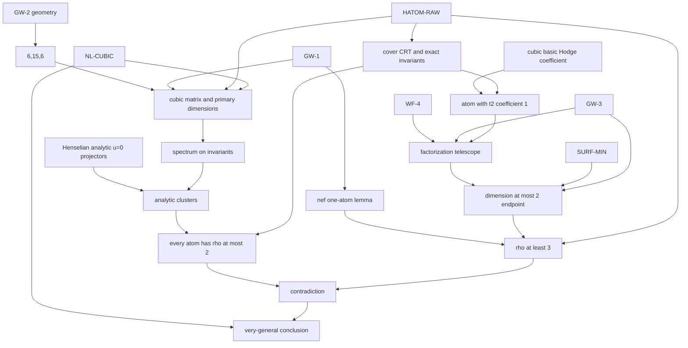

# Theorem 6.8 — formal atom core and the Henselian analytic split

**Date:** 2026-07-29
**Work orders:** WP-3, corrected and minimized in WP-4
**Outcome:** the analytic $u=0$ primary projectors are internal by
Henselianity of the analytic local ring. The full formal $u$-horizontal
extension remains proved, but is not load-bearing for Theorem 6.8.
**Status:** WP-4 worker deliverable; **STOP at director review before WP-5**.

## 1. Verdict and scope

The repaired cubic-fourfold proof does not need HYZZ's product decomposition
of the base, tangent distributions, maximality of the factors, or an analytic
projector depending on $u$. Its consumers read only the primary decomposition
of the analytic bundle at $u=0$: certificate Proposition 3.3, Lemma 3.2(4),
Corollary 3.4, and R3. HP constructs that decomposition directly over
the Henselian stalk $\mathcal O_{S,b}$ by characteristic-polynomial
factorization and CRT. The idempotents are canonical and hence
Hodge-equivariant.

The old `SEP-CONV` package is therefore retired. The full formal
$u$-horizontal theorem, the completion-injectivity lemma, and the corrected
HYZZ convergence analysis are retained as FP and in Section 5 because they are
valid independent results. They have no edge to Theorem 6.8. In particular,
failure to prove convergence of the infinite formal gauge no longer leaves an
analytic axiom on the target path.

The remaining sections specify the entire Lean spine. An item marked
**internal** is a theorem to prove in that development, not an additional
axiom. In particular, `GW-2`, the certificate's Lemmas 3.1--3.6 and
Proposition 3.7, cover CRT, atom/Hodge bookkeeping, and every finite
calculation are internal.

This remains a conditional spine, not an unconditional proof of Theorem 6.8:
the named F3, Hodge, analytic, and birational packages below remain opaque
until independently formalized.

## 2. The only top-level hypotheses

The single table of record, with exact wording and use-sites, is
[GW_INPUT.md](GW_INPUT.md), Section 2. The top theorem takes exactly six
named packages:

1. **`GW-1`** — target analytic A-model matrices, Hodge action, and the
   virtual-dimension and unit rules. Source: KKPY v2, SHA-256
   `2c5c9f0a2f9eaf230605eaf844c3b7d08e0181e6dbc921153156a071d616ff64`.
2. **`GW-3`** — the two consumed Hodge-graded blowup formulas: surface at a
   point and fourfold along a center of dimension at most two. Sources:
   KKPY/Iritani, SHA-256 values
   `2c5c9f0a2f9eaf230605eaf844c3b7d08e0181e6dbc921153156a071d616ff64`,
   `c16f56b283863322df04dadaeb0780889abd67a664f56a74fea39bc7ba8a934b`,
   and
   `0114923576b2ec3a78fc346fd9f61eb65cfe63f8cc7087881d11626cdb9883c3`.
3. **`WF-4`** — projective weak factorization for the endpoint pair
   $\mathbf P^4,X$. Source: AKMW, SHA-256
   `55bbc2c58f29d4b9dbe965035f80f3844f6968eaf98076ac625132ac3b3977a5`.
4. **`HATOM-RAW`** — the connected smooth/reduced fixed base, dense spectral
   locus, proreductive Hodge action, finite étale reduced spectral cover, and
   raw $p-q$ grading. Only the degree-four cubic fixed-vector identification
   and fixedness of algebraic cycle classes are exposed; primary bundles and
   descent of $\rho$ and $P$ are internal. Main source: the pinned KKPY v2
   artifact. The
   proreductive-to-semisimple bridge is pinned to Deligne--Milne, SHA-256
   `48f8af5249081217fc4a806414a764d9d69d66eff9092ddd8e2cf0ea078579e8`.
5. **`NL-CUBIC`** — only the rank-one middle rational Hodge-class statement
   off a countable union and that union's proper-closed parameter-space form.
   The universal cubic identity $[t^2]=1$ is an internal basic-Hodge lemma,
   not part of this Noether--Lefschetz package. Source: Hassett, SHA-256
   `ecc2e31a63f56d443aaa3534f0218b25a5b6ab6e1a84c82db5c7bac1789a1d21`.
6. **`SURF-MIN`** — $P_1=p_g$, birational invariance of plurigenera, and a
   finite sequence of $(-1)$-curve contractions from the given smooth
   projective surface to a smooth projective minimal model with nef canonical
   class when a plurigenus is positive. Reversing the sequence gives ordinary
   point blowups. Source: Peters, SHA-256
   `51f9c99621b3819aa85894a8cdee4a528b0894364fc22b40a651f1bae55ceed3`.

`GW-2` is deliberately absent from this list. Its degree-one line-incidence
theorem is an F2 internal file, followed by the F0 calculation in Section 9.
Proposition 5.28 is also absent: it is downstream of Theorem 6.8.

A Lean-shaped top signature now uses fixed coordinates on the projective
parameter space of equations:

```lean
def CubicMonomial :=
  {m : Fin 6 →₀ ℕ // m.sum (fun _ e => e) = 3}

abbrev CubicCoefficients := CubicMonomial → ℂ
abbrev CubicParameter := Projectivization ℂ CubicCoefficients
def SmoothCubicLocus : Set CubicParameter :=
  {x | Smooth (CubicFourfold.toSpec x)}
abbrev SmoothCubicParameter := ↥SmoothCubicLocus

structure CubicHodge22Fiber (X : SmoothCubicParameter) where
  H4Q : Type
  [addCommGroupH4Q : AddCommGroup H4Q]
  [moduleH4Q : Module ℚ H4Q]
  [finiteDimensionalH4Q : FiniteDimensional ℚ H4Q]
  classes22 : Submodule ℚ H4Q
  hyperplaneSq : H4Q
  hyperplaneSq_mem : hyperplaneSq ∈ classes22
  hyperplaneSq_ne_zero : hyperplaneSq ≠ 0

noncomputable def cubicHodge22Fiber
    (X : SmoothCubicParameter) : CubicHodge22Fiber X := ...

abbrev RationalHodgeClasses22 (X : SmoothCubicParameter) :
    Submodule ℚ (cubicHodge22Fiber X).H4Q :=
  (cubicHodge22Fiber X).classes22

def NLGeneral (X : SmoothCubicParameter) : Prop :=
  Module.finrank ℚ (RationalHodgeClasses22 X) = 1

structure NLCubicFamily where
  exceptional : ℕ → ProperClosedSubset
  avoidance_nlGeneral : ∀ X : SmoothCubicParameter,
    X.1 ∉ ⋃ n, (exceptional n).carrier → NLGeneral X

def IsRational (X : SmoothCubicParameter) : Prop :=
  Scheme.BirationalOver
    (CubicFourfold.toSpec X.1)
    (ProjectiveSpace.toSpec 4 ℂ)

theorem nlGeneral_not_isRational
    (gw1 : GW1Family) (gw3 : GW3) (wf4 : WF4)
    (hatom : HAtomRawFamily) (surf : SurfaceMinimalPackage)
    (X : SmoothCubicParameter) (hX : NLGeneral X) :
    ¬ IsRational X

theorem theorem_6_8_countable_union
    (gw1 : GW1Family) (gw3 : GW3) (wf4 : WF4)
    (hatom : HAtomRawFamily) (nl : NLCubicFamily)
    (surf : SurfaceMinimalPackage) :
    ∃ D : ℕ → ProperClosedSubset,
      ∀ X : SmoothCubicParameter,
        X.1 ∉ ⋃ n, (D n).carrier → ¬ IsRational X

def HoldsForVeryGeneralSmoothCubic
    (P : SmoothCubicParameter → Prop) : Prop :=
  ∃ D : ℕ → ProperClosedSubset,
    ∀ X, X.1 ∉ ⋃ n, (D n).carrier → P X

theorem veryGeneral_smoothCubic_not_isRational
    (gw1 : GW1Family) (gw3 : GW3) (wf4 : WF4)
    (hatom : HAtomRawFamily) (nl : NLCubicFamily)
    (surf : SurfaceMinimalPackage) :
    HoldsForVeryGeneralSmoothCubic (fun X => ¬ IsRational X)

theorem addingtonAuel_NLGeneral :
    NLGeneral addingtonAuelParameter

theorem addingtonAuel_not_isRational
    (gw1 : GW1Family) (gw3 : GW3) (wf4 : WF4)
    (hatom : HAtomRawFamily) (surf : SurfaceMinimalPackage) :
    ¬ IsRational addingtonAuelParameter
```

Here `CubicParameter` is $\mathbf P^{55}(\mathbf C)$, not a quotient by
$\operatorname{PGL}_6$; `ProperClosedSubset` is cut out by homogeneous
coefficient equations and is not required to be a divisor. The explicit
Addington--Auel theorem is a supported target because WP-4 supplies a
replayable proof of `addingtonAuel_NLGeneral`, not merely a stretch goal.
Sections 6–8 of
[GENERALITY.md](GENERALITY.md) specify the missing definitions and existing
Problem-B/Mathlib reuse. This remains target syntax; no Lean implementation
is claimed yet.

## 3. Concrete data and coefficient rings

### 3.1 Fields and the cubic point

Let:

- $F=\overline{\mathbf Q}$;
- $k$ be the algebraically closed non-archimedean coefficient field supplied
  by `GW-1`, of characteristic zero, with $F\hookrightarrow k$;
- $q_0\in k^\times$ have positive valuation;
- $r^3=q_0$ and $\zeta$ be a primitive cube root of unity.

Only finite-dimensional $F$-representations and their scalar extensions to
$k$ occur. There is no nc-Hodge or infinity-category object in the core.

### 3.2 Formal and analytic bases

For arbitrary $n$, put

$$
R=k[[t_1,\ldots,t_n]],\qquad A=R[[u]],\qquad
\mathfrak m=(t_1,\ldots,t_n)\subset R.
$$

The formal theorem is uniform in $n$. It applies to the full $n=27$ formal
A-model germ and, more economically, to the $n=5$ completed fixed germ used
in the repaired proof. The preferred Lean models are:

```lean
abbrev R (n : Nat) := MvPowerSeries (Fin n) k
abbrev A (n : Nat) := PowerSeries (R n)
abbrev m (n : Nat) : Ideal (R n) :=
  Ideal.span (Set.range (MvPowerSeries.X : Fin n -> R n))
```

The installed Mathlib synthesizes `IsLocalRing (R n)`,
`IsAdicComplete (m n) (R n)`, and `HenselianRing (R n) (m n)`. It does
not synthesize `HenselianLocalRing (R n)`, so the ideal must remain explicit.

For an analytic germ $(S,b)$, write

$$
R_{\mathrm{an}}=\mathcal O_{S,b},\qquad
\widehat R_{\mathrm{an}}\simeq k[[t_1,\ldots,t_n]].
$$

The stalk $R_{\mathrm{an}}$ is Henselian. Fresnel--van der Put, *Rigid
Analytic Geometry and Its Applications*, Proposition 7.1.8(1), printed
pp. 199--200, states this for the stalk at every prime filter; a rigid point
gives a maximal, hence prime, filter. See the [local PDF](../tmp/pdfs/fresnel-van-der-put-rigid-analytic-geometry.pdf),
SHA-256
`54bac91f89abcd9a42645b1a07624222aeb570048ed224e4cd79a328fd7ef915`.
Berkovich, *Étale cohomology for non-Archimedean analytic spaces*, Theorem
2.1.5, is an independent direct statement and proof; [local
PDF](../tmp/pdfs/berkovich-etale-cohomology.pdf), SHA-256
`bd864c89ed8b6e8f27a90f459837221549db75afa75554ab51414e17771066af`.
Bosch's 1977 formal-fiber paper is retained as the historical source requested
by the work order, [local scan](../tmp/pdfs/bosch-formal-fibers-affinoid.pdf),
SHA-256
`e50ea3b1868f3c6c2aae7ff4394c45484732c33bba30184855e7a380fe42aa8b`,
but the certificate does not miscite BGR §7.3.2 as the direct Henselian-stalk
theorem. Smoothness is used only for the displayed regular completion;
finite projectivity over the local ring supplies freeness. Henselianity itself holds for analytic local rings in the cited
theorems.

If $S=B^G$ is a fixed locus, $\mathcal O_{S,b}$ is a quotient of the ambient
local ring. It is not silently $\mathcal O_{B,b}^G$. Restriction of modules
and matrices is tensor base change along that quotient.

### 3.3 Modules, operators, and connection matrices

Let $M$ be finite free of rank $N$ over $A$. After choosing a basis, the only
connection data used are

$$
U(t,u),T_a(t,u)\in\operatorname{End}_A(M),\qquad 1\le a\le n,
$$

with

$$
\nabla_{\partial_u}=\partial_u+u^{-2}U(t,u),\qquad
\nabla_{\partial_{t_a}}=\partial_{t_a}+u^{-1}T_a(t,u),
$$

and the matrix flatness identities. A horizontal projector is
$e\in\operatorname{End}_A(M)$ satisfying

$$
e^2=e,\qquad
u^2\partial_u e+[U,e]=0,\qquad
u\partial_{t_a}e+[T_a,e]=0.
$$

For the even base coordinates actually consumed, flatness means explicitly

$$
[T_a,U]+u\,\partial_{t_a}U+uT_a-u^2\partial_uT_a=0,
\qquad
[T_a,T_b]+u(\partial_{t_a}T_b-\partial_{t_b}T_a)=0. \tag{3.1}
$$

In particular $[T_{a,0},U_0]=0$. For odd coordinates the corresponding
graded commutators carry the Koszul signs; no odd-coordinate identity is used
below.

On an analytic representative the connection lives on a vector bundle over a
product $B\times D_u$ (with $u\ne0$ where the meromorphic connection is
evaluated). Writing a finite locally free $\mathcal O_S[[u]]$-module means its
formal germ along $u=0$, not an analytic bundle on the whole product. The
load-bearing construction below takes the actual analytic restriction at
$u=0$ over $S$; the formal $[[u]]$ model is used only by the non-load-bearing
Formal Horizontal-Projector Theorem (FP).

The closed fiber is $V=M/(u,t_1,\ldots,t_n)M$. Keep two operators distinct:

$$
\kappa_{\mathrm{at}}=L_{\mathrm{Eu}},\qquad
K_{\mathrm{res}}
=\left.u^2\nabla_{\partial_u}\right|_{u=0}
=-\kappa_{\mathrm{at}}.
$$

Negation sends $\lambda$ to $-\lambda$ but changes neither generalized
eigenspaces nor dimensions. Atom labels use $\kappa_{\mathrm{at}}$; the
formal splitting theorem sees $K_{\mathrm{res}}$.

## 4. Separated projectors — analytic $u=0$ core and formal extension

### Henselian Primary-Projector Theorem (HP; `analyticPrimaryProjectorsAtUZero`) — load-bearing

Let $(R,\mathfrak m,k)$ be a Henselian local ring, let $M_0$ be finite free
over $R$, and let $K\in\operatorname{End}_R(M_0)$. Suppose the closed fiber
$\bar M_0$ has a finite $K_b$-stable decomposition

$$
\bar M_0=\bigoplus_{i\in I}V_i
$$

whose block characteristic polynomials $\chi_i$ are pairwise coprime. Then
there is a unique complete family of $K$-commuting orthogonal idempotents
$e_{i,0}\in\operatorname{End}_R(M_0)$ reducing to the displayed projectors.
Their images are finite projective direct summands. Any symmetry commuting
with $K$ and preserving the closed clusters preserves this family.

**Proof.** The characteristic polynomial of $K$ reduces to
$\prod_i\chi_i$. Hensel factorization gives unique monic factors
$F_i\in R[Z]$ lifting $\chi_i$ with

$$
\det(Z-K)=\prod_iF_i(Z).
$$

Their pairwise resultants are units. Put $G_i=\prod_{j\ne i}F_j$ and choose
$a_i,b_i\in R[Z]$ with $a_iF_i+b_iG_i=1$. Then

$$
e_{i,0}=b_i(K)G_i(K)
$$

are complete orthogonal $K$-commuting idempotents, and Cayley--Hamilton gives
$\operatorname{im}(e_{i,0})=\ker F_i(K)$. For uniqueness, any other
$K$-commuting lift is block diagonal because every off-diagonal Sylvester map
has unit determinant; Nakayama kills its discrepancy on each diagonal block.
Canonicity proves the symmetry assertion. ∎

Apply this with $R=\mathcal O_{S,b}$, $M_0=(\mathcal H|_{u=0})_b$, and
$K=K_{\mathrm{res}}$. Each matrix entry is an analytic germ, so the finite
family is represented after one common shrink of $S$. An idempotent image is
a vector subbundle. Thus this theorem gives exactly the analytic $u=0$
cluster bundles consumed by Proposition 3.3 and R2, without completing the
ring and without any convergence assertion in $u$.

### Formal Horizontal-Projector Theorem (FP; `formalHorizontalProjectors`) — proved, non-load-bearing

Let $R$, $A$, and $M$ be as above. Assume the matrices of Section 3.3 are
flat, and write

$$
U(t,u)=\sum_{m\ge0}U_m(t)u^m,\qquad K_b=U_0(0).
$$

Suppose $I$ is finite and

$$
V=\bigoplus_{i\in I}V_i
$$

is $K_b$-stable and the characteristic polynomials
$\chi_i(Z)=\det(Z-K_b|_{V_i})$ are pairwise coprime. Then there is a unique
complete family of orthogonal horizontal projectors

$$
e_i(t,u)\in\operatorname{End}_A(M)
$$

reducing to the projectors onto $V_i$. Their images give a formal direct sum
preserved by every displayed connection operator. No maximality assumption
occurs.

### Step 1 — lift the $u=0$ primary decomposition

The formal ring $R=k[[t_1,\ldots,t_n]]$ is Henselian, so HP applies
to $U_0(t)$. Concretely, its characteristic polynomial reduces to
$\prod_i\chi_i$ at $t=0$, and Hensel factorization gives unique monic
$F_i(t,Z)\in R[Z]$ lifting $\chi_i$ with

$$
\det(Z-U_0(t))=\prod_iF_i(t,Z).
$$

Every pairwise resultant reduces to a nonzero element of $k$, so it is a unit
of $R$. Put $G_i=\prod_{j\ne i}F_j$, and choose $a_i,b_i\in R[Z]$ with

$$
a_iF_i+b_iG_i=1.
$$

Then

$$
e_{i,0}=b_i(U_0)G_i(U_0)
$$

are orthogonal idempotents summing to one. Cayley--Hamilton gives
$\operatorname{im}(e_{i,0})=\ker F_i(U_0)$. The images are finite projective,
hence free because $R$ is local.

This is the only raw Hensel/idempotent step. Theorem 6.8 stops here. The
remaining steps prove the stronger formal $u$-horizontal extension but are
not used by any target consumer.

Choose an $R$-basis of each free module
$M_i=\operatorname{im}(e_{i,0})$ and concatenate these bases. The resulting
$u$-independent gauge $Q(t)\in\operatorname{GL}_N(R)$ makes the $e_{i,0}$
constant coordinate projectors. Under this gauge,

$$
U\longmapsto Q^{-1}UQ,
\qquad
T_a\longmapsto Q^{-1}T_aQ+uQ^{-1}\partial_{t_a}Q,
$$

so the connection retains the form of Section 3.3 and remains flat. From now
on all block matrices and off-diagonal parts are taken relative to these fixed
coordinate summands. In particular, differentiating a block-diagonal matrix
with respect to $t_a$ remains block diagonal.

### Step 2 — the Sylvester inverse

Write $M_i=\operatorname{im}(e_{i,0})$ and $U_{0,i}=U_0|_{M_i}$. For
$i\ne j$, define

$$
\mathcal S_{ij}:
\operatorname{Hom}_R(M_j,M_i)\longrightarrow\operatorname{Hom}_R(M_j,M_i),
\qquad X\longmapsto U_{0,i}X-XU_{0,j}.
$$

Its determinant, up to the sign from basis order, is the resultant of the two
block characteristic polynomials. It is a unit, so $\mathcal S_{ij}$ is an
isomorphism. Consequently every off-diagonal coefficient is recovered
uniquely from its commutator with $U_0$, and

$$
[X,U_0]\text{ block diagonal}\quad\Longrightarrow\quad
X\text{ block diagonal}.
$$

This permits non-semisimple blocks.

### Step 3 — kill every off-diagonal $u$-coefficient

Under a gauge $P=1+u^mX_m(t)$, the $u$-connection matrix becomes

$$
U^P=P^{-1}UP+u^2P^{-1}\partial_uP.
$$

Modulo $u^{m+1}$, its degree-$m$ coefficient changes by

$$
U_m\longmapsto U_m+[U_0,X_m].
$$

The derivative term starts in degree $m+1$. The direct sum of the
$\mathcal S_{ij}^{-1}$ therefore gives the unique off-diagonal $X_m$ that
kills the off-diagonal part of $U_m$ without changing lower orders. Induction
on $m\ge1$ produces gauges $1+u^mX_m$. Their ordered product and inverse
converge $u$-adically, and all transformed $U_m(t)$ are block diagonal.

Equivalently, writing $e_i=\sum_{r\ge0}e_{i,r}u^r$, idempotency determines
the diagonal part at order $r\ge1$:

$$
e_{i,0}e_{i,r}+e_{i,r}e_{i,0}-e_{i,r}
=-\sum_{a=1}^{r-1}e_{i,a}e_{i,r-a},
$$

while $u$-horizontality determines the off-diagonal part:

$$
[U_0,e_{i,r}]
=-(r-1)e_{i,r-1}-\sum_{a=1}^{r}[U_a,e_{i,r-a}].
$$

The gauge construction proves compatibility and preserves orthogonality and
completeness.

### Step 4 — flatness handles the base directions

After the gauge, expand $T_a=\sum_{m\ge0}T_{a,m}u^m$. Flatness gives
$[T_{a,0},U_0]=0$ and, for $m\ge1$,

$$
[T_{a,m},U_0]
=(m-2)T_{a,m-1}-\partial_{t_a}U_{m-1}
-\sum_{\substack{r+s=m\\r<m}}[T_{a,r},U_s]. \tag{4.2}
$$

The right side is block diagonal by induction. Step 2 forces $T_{a,m}$ to be
block diagonal. Thus the constant block projectors in the gauged basis are
horizontal in every direction. Conjugating back gives the required $e_i$.

### Step 5 — uniqueness

Let $e'$ be another horizontal idempotent lifting the same fiber block. At
$u=0$, horizontality gives $[U_0,e'_0]=0$, so Step 2 makes $e'_0$ block
diagonal. On the selected block, $1-e'_0$ is idempotent with zero reduction;
on every other block, $e'_0$ has zero reduction. Their images are finite
projective, so Nakayama makes them zero. Hence $e'_0=e_{i,0}$.

If $d=e-e'\ne0$, choose its least $u$-order:

$$
d=u^rd_r+O(u^{r+1}),\qquad r\ge1.
$$

The first coefficient of $u^2\partial_ud+[U,d]=0$ gives $[U_0,d_r]=0$, so
$d_r$ is block diagonal. The first coefficient of the difference of the
idempotent equations gives

$$
e_{i,0}d_r+d_re_{i,0}=d_r.
$$

On the selected block this is $2d_r=d_r$; on every other block it is
$0=d_r$. Thus $d_r=0$, contradiction. The family is unique. Any symmetry
preserving the matrices transports it to another such family, so uniqueness
also proves equivariance. This proves FP. ∎

## 5. Non-load-bearing full-$u$ analytic upgrade audit

### 5.1 Completion does not prove convergence

The smooth analytic local ring $R_{\mathrm{an}}$ is Noetherian. Krull
intersection gives

$$
\bigcap_{r\ge0}\mathfrak m^rR_{\mathrm{an}}=0,
$$

so the completion map
$R_{\mathrm{an}}\to\widehat R_{\mathrm{an}}$ is injective. Entrywise, two
analytic matrix germs with the same Taylor series therefore agree. This is an
internal algebraic lemma, `analyticGerm_completion_injective`; it is what
upgrades formal uniqueness to analytic uniqueness.

Injectivity does **not** imply that entries of an arbitrary formal gauge lie
in $R_{\mathrm{an}}$. Artin approximation also does not produce one exact
convergent solution of this infinite differential system. Thus FP
alone supplies no analytic summand depending analytically on $u$. This does
not affect Theorem 6.8, whose analytic $u=0$ summands are already supplied by
HP.

### 5.2 The finite analytic split at $u=0$

Choose constant coordinates for the closed blocks and write
$U_0(t)\in\operatorname{Mat}_N(R_{\mathrm{an}})$. For an off-diagonal matrix
$X$, consider the analytic map

$$
\Psi(t,X)=\operatorname{offdiag}
\bigl((1+X)^{-1}U_0(t)(1+X)\bigr).
$$

Its derivative in $X$ at $(0,0)$ is the direct sum of the Sylvester maps from
Step 2, hence is invertible. The non-archimedean analytic implicit-function
theorem therefore produces a unique small analytic $X(t)$ with
$\Psi(t,X(t))=0$ after shrinking. Conjugating the constant block projectors by
$1+X(t)$ gives the required analytic $U_0$-stable decomposition.

This gives an independent analytic-implicit-function proof of the finite
$u=0$ theorem, but is no longer an interface. A coefficient-majorant form of
the needed implicit-function theorem is Alberto Vezzani,
*A Motivic Version of the Theorem of Fontaine and Wintenberger*, Proposition
A.1.1, printed pp. 55--56 of the pinned artifact, SHA-256
`bf53f2958e17de3ece49c27d433f98f9a55086fedd4c7cbb65e9bb15682e8f4d`.
Its Banach proof gives positive convergence radius; applying it to the finite
matrix system above is the stated specialization.

### 5.3 The genuine estimate in HYZZ

HYZZ Proposition 3.36 writes the formal gauge as

$$
P=\prod_{m\ge1}\prod_vP_{m,v},\qquad
P_{m,v}=1+u^mt^vT_{m,v},
$$

where $\phi$ is the inverse of the off-diagonal commutator with $U_0(0)$ and

$$
T_{m,v}
=\phi\!\left(\operatorname{offdiag}
[u^mt^v]\widetilde U_{m,v}\right).
$$

It chooses a polydisk $D(\delta,\epsilon)$ with

$$
\delta\lVert\phi\rVert\le1,\qquad
\lVert\phi\rVert
\lVert\widetilde V_{1,0}\rVert_{\delta,\epsilon}<1,
$$

and proves by double induction

$$
\begin{aligned}
\lVert u^mt^vT_{m,v}\rVert_{\delta,\epsilon}
&\le\lVert\phi\rVert
      \lVert\widetilde V_{m,v}\rVert_{\delta,\epsilon}\\
&\le\lVert\phi\rVert
      \lVert\widetilde V_{m,0}\rVert_{\delta,\epsilon}\\
&\le\lVert\phi\rVert
      \lVert\widetilde V_{1,0}\rVert_{\delta,\epsilon}<1.
\end{aligned} \tag{5.1}
$$

The induction expands each conjugation, uses the ultrametric maximum, and
controls commutators by

$$
\lVert u^mt^v[T_{m,v},U_0]\rVert
\le\lVert\widetilde V_{m,v}\rVert.
$$

This norm induction is the genuine analytic content. A certificate-level
reproof must repair two points in the printed argument:

1. its last displayed maximum is self-referential; the intended first term is
   the preceding $\lVert\widetilde V_{m',0}\rVert$; and
2. a uniform bound $<1$ does not alone make infinitely many factors tend to
   $1$ on the same closed boundary polydisk. On a strict shrink
   $\delta'<\delta$, $\epsilon'<\epsilon$, the $(m,v)$ correction gains

   $$
   (\delta'/\delta)^m(\epsilon'/\epsilon)^{|v|}\longrightarrow0,
   $$

   which makes both $P$ and $P^{-1}$ converge. A germ theorem needs only this
   strict shrink.

This work order does not reproduce every conjugation estimate and the full
double induction. It therefore does not claim convergence of the full formal
gauge. That unresolved independent question is not an axiom: no downstream
consumer asks for an analytic projector away from $u=0$. Taylor-map
injectivity remains the internal result of Section 5.1.

### 5.4 Exact source boundary and target use

The pinned HYZZ artifact has these anchors:

- Lemma 3.15, printed pp. 16--17: complete-local idempotent deformation;
- Proposition 3.26, p. 21: formal $u$-gauge recursion;
- Lemma 3.28 and Proposition 3.29, pp. 22--23: ring Sylvester and flatness;
- Theorem 3.32, pp. 23--24: the stronger formal product statement;
- Proposition 3.36, pp. 25--27: convergence;
- Theorem 3.42, pp. 27--28: the stronger maximal/product theorem.

HP discharges the finite analytic $u=0$ split. HYZZ
Proposition 3.36 concerns the stronger full-$u$ convergence problem and is
retained only as audited research material. Since the target needs no
full-$u$ analytification, `SEP-CONV`, Taylor-map injectivity, and Proposition
3.36 all have no edge to Theorem 6.8. The proof first restricts the rank-27
connection to the five-dimensional fixed germ and splits $U_0$ there. The
Hodge group acts trivially on that base and equivariantly on fibers;
canonicity of the Henselian CRT projectors makes them equivariant. The former
moving-base argument and HYZZ's product-base machinery are not consumed.

## 6. Internal linear and representation lemmas

### 6.1 Primary projectors and sign (F0/F1)

Over an algebraically closed field, use
`Module.End.maxGenEigenspace`. Over a coefficient ring, use images of CRT
polynomial idempotents rather than an undefined set of ring-valued
eigenvalues.

The internal sign lemma is

$$
\operatorname{maxGenEigenspace}(-T,-\lambda)
=\operatorname{maxGenEigenspace}(T,\lambda).
$$

It follows by pulling $(-1)^N$ out of $(-T+\lambda)^N$. This is the complete
reconciliation $K_{\mathrm{res}}=-\kappa_{\mathrm{at}}$.

### 6.2 Spectrum on invariants (A2 / KKPY Lemma 5.19, F1)

Let $C$ be a finite-dimensional unital commutative $k$-algebra with a $G$
action by algebra automorphisms. Let $x\in C^G$ and $T=L_x$. The reduced
spectrum of $T$ on $C$ equals that on $C^G$.

One inclusion follows from stability. For the other, let $p_\lambda(T)$ be
the polynomial primary projector for a reduced eigenvalue $\lambda$. It is
equivariant, and

$$
p_\lambda(T)(1)=p_\lambda(x).
$$

If this were zero, commutativity would give
$p_\lambda(T)(c)=p_\lambda(x)c=0$ for all $c$, contradicting that it is a
nonzero primary projector. Hence its image contains a nonzero invariant
vector, proving the reverse inclusion.

### 6.3 Exact invariants and base change (certificate Lemma 3.1, F1)

Use finite-dimensional rational representations of a proreductive affine
group over a characteristic-zero field. Every finite collection factors
through one reductive quotient. Its representation category is semisimple,
so every equivariant short exact sequence splits and fixed vectors form an
exact functor.

For a field extension $F'/F$,

$$
(V^G)\otimes_FF'\simeq(V\otimes_FF')^{G_{F'}}.
$$

In a comodule model, invariants are the kernel of
$v\mapsto\rho(v)-v\otimes1$; flat scalar extension preserves this kernel. A
Reynolds projector makes invariants in a stable direct-summand bundle another
direct-summand bundle, whose rank is locally constant and therefore constant
on a connected base.

This invariant-rank statement is separate from the $p-q$ grading. The grading
cocharacter decomposes the underlying finite bundle into weight subbundles;
their **ordinary** ranks are locally constant. The individual weight spaces
need not be $G$-stable, and no fixed vectors are taken when defining the Hodge
polynomial.

`HATOM-RAW` supplies only the raw rational action of a proreductive group. An
internal theorem `linearlyReductiveActionOfProreductive`, using the pinned
characteristic-zero semisimplicity theorem, constructs the small
`LinearlyReductiveAction` structure exposing splitting/Reynolds and base-change
laws. Lemma 3.1 then derives exact invariants and constant invariant rank. This
does not silently bundle those consequences into `HATOM-RAW`, nor pretend that
finite-group averaging proves the proalgebraic case.

## 7. Cover-native atoms and numerical data

### 7.1 Generalized-eigenbundle on a finite étale cover (F2)

Let $S$ be a connected smooth analytic base (hence irreducible and reduced),
let $U\subset S$ be a nonempty Zariski-open subset, and let
$\pi:\widetilde U\to U$ be the finite étale reduced spectral cover, with
$\ell$ its tautological eigenvalue. On an étale chart splitting the cover
into branches $\ell_1,\ldots,\ell_s$, set

$$
g_i(Z)=(Z-\ell_i)^N.
$$

The differences $\ell_i-\ell_j$ are units, so the $g_i$ are pairwise
comaximal. At every rigid point, Cayley--Hamilton on the generalized
eigenspaces gives

$$
\prod_i g_i(\kappa_{\mathrm{at}})=0.
$$

The coefficient affinoid is reduced and Jacobson, so pointwise vanishing
implies matrix vanishing. This internal reduced-Jacobson lemma is pinned for
the analytic model to Conrad, SHA-256
`5add29094b74385746c4d977290b2308d02cbe8aa6f085e6a99724f6939e309b`.

CRT gives polynomials $q_i$ that are $1$ modulo $g_i$ and $0$ modulo every
$g_j$, $j\ne i$. Thus $q_i(\kappa_{\mathrm{at}})$ are complete orthogonal
idempotents. On the $j$-th image for $j\ne i$,

$$
\kappa_{\mathrm{at}}-\ell_i
=(\ell_j-\ell_i)+(\kappa_{\mathrm{at}}-\ell_j)
$$

is a unit plus a nilpotent, hence invertible. Therefore

$$
\ker(\kappa_{\mathrm{at}}-\ell_i)^N
=\operatorname{im}q_i(\kappa_{\mathrm{at}}),
$$

an idempotent-image vector subbundle. The intrinsic kernel description
patches and descends. On a connected component $C\subset\widetilde U$, this
is the cover-native atomic bundle $\mathcal A_C$.

A connected smooth base is irreducible (its regular irreducible components
are disjoint and open), so the nonempty Zariski-open \(U\) is connected. A connected
component of a finite étale cover maps openly and closedly to \(U\); its
nonempty image is therefore all of \(U\). Its geometric
fiber cardinality is its constant finite-étale degree. These deductions
justify every point choice and multiplicity; surjectivity is not an extra
axiom.

### 7.2 Canonical clusters and pointwise localization (F2)

Apply HP to $K_{\mathrm{res}}$ over the Henselian analytic stalk of
the fixed germ. It gives the canonical analytic $u=0$ cluster projectors
directly. Transport by the Hodge action gives another $K_{\mathrm{res}}$-
commuting lift of the same closed blocks, so Henselian uniqueness makes every
cluster projector equivariant. No formal completion or full-$u$ convergence
is used.

Let $W\subset S$ be the connected splitting neighborhood. Density gives
$U\cap W\ne\varnothing$. For every cover component $C$, surjectivity gives a
point $x\in C$ above $U\cap W$. Its tautological eigenvalue belongs to a
unique separated cluster, so

$$
(\mathcal A_C)_x\subset(\mathcal E_i)_{\pi(x)}.
$$

Exact invariants and constant rank give

$$
\rho_C:=\dim(\mathcal A_C^G)_x
\le\dim(\mathcal E_i^G)_{\pi(x)}
=\dim(\mathcal E_i^G)_b. \tag{7.1}
$$

This is exactly what certificate Lemma 3.2 and Proposition 3.3 contribute.

### 7.3 Atom type, chemical formula, and Laurent Hodge polynomial (F0/F1)

Begin with raw connected spectral-cover components. Here an **isomorphism of
cover-native data** from $C\to U$ to $C'\to U'$ means an isomorphism of base
germs $U\simeq U'$, an isomorphism $C\simeq C'$ over it compatible with the
tautological eigenvalue, and a grading-preserving equivariant vector-bundle
isomorphism

$$
\ker(\kappa_{\mathrm{at}}-\ell)^N
\simeq
\ker(\kappa'_{\mathrm{at}}-\ell')^N
$$

that intertwines the induced primary operator and unital algebra structure.
This is the exact data needed to preserve the Hodge representation, the
$p-q$ grading, $P_\alpha$, and $\rho_\alpha$; an isomorphism of the finite
covers alone is not enough.

Generate an equivalence relation only from:

- isomorphism of cover-native data;
- transport inside one connected component;
- disjoint-union identifications; and
- smooth-blowup correspondences supplied by `GW-3`.

Do **not** impose projective-bundle equivalence. Let `Atom` be the quotient.
A chemical formula is:

```lean
abbrev ChemicalFormula := Atom ->₀ Nat
```

Disjoint union is addition in this free commutative monoid.

For the grading-cocharacter decomposition
$E^\alpha=\bigoplus_dE_d^\alpha$, set

$$
P_\alpha(t)=\sum_{d\in\mathbf Z}
  \dim_F(E_d^\alpha)t^d\in\mathbf N[t,t^{-1}],
\qquad
\rho_\alpha=\dim_F(E^\alpha)^G.
$$

The Lean carrier is `AddMonoidAlgebra Nat Int`, equivalently
`Int ->₀ Nat`, not an ordinary polynomial: $p-q$ may be negative.
Graded isomorphisms and the retained atom correspondences preserve the
ordinary weight dimensions, while Section 6.3 handles the separate invariant
dimension. Connectedness makes both kinds of ranks constant, so $P_\alpha$
and $\rho_\alpha$ descend to the quotient.

At one point of $U$, the full Hodge realization is the direct sum of the
cover-native bundles. Taking ordinary grading-weight dimensions proves the
Hodge-polynomial identity; separately taking exact invariants proves the
$\rho$ identity. Grouping points by connected component and using constant
ranks gives certificate Corollary 3.4:

$$
\operatorname{HP}_{\mathrm{fold}}(Y;t)
=\sum_{C\in\pi_0(\widetilde U_Y)}
  \deg(C/U_Y)P_{\bar C}(t). \tag{7.2}
$$

Every coefficient in (7.2) is a nonnegative integer.

### 7.4 Optional downstream Proposition 5.28

Every nonzero primary factor has a unital algebra projector. Its unit is
fixed, so its invariant dimension is at least one. This proves
$\rho_\alpha\ge1$. It is F1 but has no edge to Theorem 6.8; place it in
`Downstream/Prop528.lean` and do not import it from `Theorem68.lean`.

## 8. Nef grading and the one-atom lemma (F1)

Let $V=\bigoplus_dV_d$ be finite-dimensional with finite grading support. An
operator that strictly raises degree is nilpotent once its power exceeds the
width of that support. Hence $-t_0\operatorname{id}+N$ has the single reduced
eigenvalue $-t_0$ and its unique primary generalized eigenspace is all of
$V$.

For a smooth projective $Y$ with nef $K_Y$, the virtual-dimension rule from
`GW-1` makes every non-scalar term of Euler multiplication strictly raise the
cohomological filtration. The fundamental-class/unit rule gives the scalar
term:

$$
\kappa_{\mathrm{at}}=-t_0\operatorname{id}+N,
\qquad N\text{ strictly degree-raising and nilpotent}.
$$

Odd nilpotent base directions cause no hidden exception: reduction modulo
the nilradical reduces the characteristic polynomial, so they create no new
point of the reduced spectrum. State this as the internal lemma
`spectrum_eq_of_nilpotent_thickening`.

Thus a connected nef-$K$ variety has one reduced spectral component and its
whole Hodge realization is its sole atom. This is certificate Lemma 3.6,
replacing KKPY Lemma 5.24.

## 9. `GW-2`: target geometry and the finite $6,15,6$ proof

### 9.1 Chosen F2 boundary: Beauville's three numbers directly

WP-4 takes the explicit fallback and dissolves the previously unnamed
expected-dimension theorem about the Fano scheme of lines. The internal
target theorem `beauvilleCubicLineCorrections` states directly that the three
ambient degree-one corrections equal

$$
\ell_p=\frac13\int_{\operatorname{Gr}(2,6)}
c_4(\operatorname{Sym}^3S^\vee)c_{3-p}(Q)c_{1+p}(Q),
\qquad p=0,1,2. \tag{9.1}
$$

Its proof target is Beauville's published complete-intersection calculation,
equations (1.6), (2.1), and the Grassmannian coefficient lemma. The main spine
does not promise a separate construction of stable-map boundary strata or a
Fano-scheme expected-dimension theorem. Those facts belong inside any future
foundational reproof of Beauville, not as unnamed premises here. The theorem
is the F2 file `Cubic/BeauvilleCorrections.lean`; the coefficient extraction
below is F0. Source: Beauville, SHA-256
`9d022796aefa01fd601820e415c5462bdfc255b3b4fe158af64b51f7bf0a83e3`.

### 9.2 F0 coefficient extraction

Let $a,b$ be the Chern roots of $S^\vee$, and put

$$
C_j(a,b)=\sum_{i=0}^ja^{j-i}b^i.
$$

The top Chern class in (9.1) is

$$
E=(3b)(a+2b)(2a+b)(3a)
=18a^3b+45a^2b^2+18ab^3.
$$

For $p=0,2$,

$$
C_{3-p}C_{1+p}
=a^4+2a^3b+2a^2b^2+2ab^3+b^4,
$$

while for $p=1$,

$$
C_2^2=a^4+2a^3b+3a^2b^2+2ab^3+b^4.
$$

If $P=EC_{3-p}C_{1+p}$, the Grassmannian functional is

$$
-\frac12[a^5b^5](a-b)^2P
=-\frac12P_{3,5}+P_{4,4}-\frac12P_{5,3}.
$$

The triples $(P_{3,5},P_{4,4},P_{5,3})$ are

$$
(144,162,144),\qquad
(162,207,162),\qquad
(144,162,144).
$$

They give $18,45,18$. Dividing by the cubic degree $3$ in (9.1) gives

$$
(\ell_0,\ell_1,\ell_2)=(6,15,6). \tag{9.2}
$$

This is a finite polynomial identity for `ring_nf` and coefficient
evaluation; no mirror theorem enters the trusted boundary.

## 10. Cubic matrix and primary dimensions (F0)

The internal lemma `cubicBasicHodge` extracts only the universal facts needed
from Hassett §2.1: $h^{3,1}(X)=1$, and outside middle degree the rational
cohomology is the diagonal span of $1,h,h^3,h^4$. Consequently

$$
[t^2]\operatorname{HP}_{\mathrm{fold}}(X;t)=1. \tag{10.H}
$$

The full Hodge diamond and total rank $27$ are not part of `NL-CUBIC` and are
not separate theorem hypotheses; the rank of the A-model fiber is already
part of the `GW-1` object.

The named internal declarations `c1_tangent_cubicFourfold` and
`integral_hyperplane_pow_four` supply the two scalar facts used here:

$$
c_1(T_X)=3h,\qquad \int_Xh^4=3. \tag{10.0}
$$

The first follows from the tangent-normal exact sequence for a cubic
hypersurface in $\mathbf P^5$ (equivalently $K_X=-3h$); Beauville §2 writes
the complete-intersection index formula
$k=n+r+1-\sum d_i$. The second is the definition of the degree and is also
recorded in Hassett §2.1 as $\langle h^2,h^2\rangle=h^4=3$. Thus neither
identity is left as an unnamed matrix premise.

On $(1,h,h^2,h^3,h^4)$, multiplication by $h$ is

$$
A(q)=
\begin{pmatrix}
0&0&6q&0&0\\
1&0&0&15q&0\\
0&1&0&0&6q\\
0&0&1&0&0\\
0&0&0&1&0
\end{pmatrix},
\qquad K(q)=3A(q).
$$

In $\det(LI-K)$, the identity permutation contributes $L^5$. The only
nonzero $qL^2$ permutations contribute
$-162qL^2,-405qL^2,-162qL^2$. Hence

$$
\det(LI-K(q))=L^5-729qL^2
=L^2(L^3-3^6q). \tag{10.1}
$$

At $q=q_0\ne0$,

$$
L^3-3^6q_0=\prod_{j=0}^2(L-9r\zeta^j).
$$

The zero kernel has basis $(0,-6q_0,0,0,1)$. The kernel of $K^2$ adds
$(-21q_0,0,0,1,0)$. Thus the zero generalized block has dimension $2$.
The three nonzero roots are simple, so their generalized blocks have
dimensions $1,1,1$.

Section 6.2 upgrades the **set** of four reduced eigenvalues from the
invariant algebra to the full rank-27 algebra. It does not claim the full
blocks have ranks $2,1,1,1$; only their invariant parts have those dimensions.

## 11. Weak factorization and the surface endpoint

### 11.1 Target-specific telescope (Proposition 3.7, F1)

If $X$ is rational, `WF-4` gives a finite factorization from $\mathbf P^4$.
Apply `GW-3` at every step and move backward-blowup terms to the left:

$$
\operatorname{CF}_{\mathrm{bl}}(X)
+\sum_{i\in\mathrm{back}}(r_i-1)
  \operatorname{CF}_{\mathrm{bl}}(Z_i)
=\operatorname{CF}_{\mathrm{bl}}(\mathbf P^4)
+\sum_{i\in\mathrm{forward}}(r_i-1)
  \operatorname{CF}_{\mathrm{bl}}(Z_i). \tag{11.1}
$$

This is equality of `Atom ->₀ Nat`, so coefficients are nonnegative.
Since $\operatorname{HP}_{\mathrm{fold}}(\mathbf P^4;t)=5$, equation (7.2)
shows that no atom of $\mathbf P^4$ has positive $t^2$-coefficient. An atom
of $X$ with positive $t^2$-coefficient must therefore occur in a center on
the right. Nontrivial centers have codimension at least two and dimension at
most two.

### 11.2 Point, curve, and surface arithmetic (F0/F1)

The named internal declarations
`foldedHodgePolynomial_projectiveSpace_four` and
`foldedHodgePolynomial_point` record

$$
\operatorname{HP}_{\mathrm{fold}}(\mathbf P^4;t)=5,
\qquad
\operatorname{HP}_{\mathrm{fold}}(\mathrm{pt};t)=1,
$$

The declaration `curve_foldedHodge_coeff_two_eq_zero` records that a smooth
projective curve has Hodge differences only $0,\pm1$. For a smooth
projective surface, `surface_foldedHodge_coeff_two_eq_pg` uses Hodge symmetry
and Serre duality to give $h^{2,0}=h^{0,2}=p_g$, so
$[t^2]\operatorname{HP}_{\mathrm{fold}}(S;t)=p_g(S)$. These are elementary
Hodge calculations, but they are no longer unnamed: Popa, *Hodge theory and
singularities*, §1.1, equation (1.1.1) and the projective-space example,
supplies Hodge symmetry, duality, and the $\mathbf P^n$ diamond; [local
PDF](../tmp/pdfs/popa-hodge-theory-singularities.pdf), SHA-256
`28cce3fa0cbd3c25491d1416f8e40a89362b6b1c14420789b3cd83e9c3f7f860`.
Peters, Chapter 1, pp. 5--6, identifies $p_g=h^{0,2}$ and uses the same
duality; SHA-256
`51f9c99621b3819aa85894a8cdee4a528b0894364fc22b40a651f1bae55ceed3`.

Consequently neither a point nor a curve can supply an atom with positive
$t^2$-coefficient. If $[t^2]P_\alpha=1$ occurs in dimension at most two, it
occurs on a connected smooth projective surface $S$, and (7.2) gives

$$
1=[t^2]P_\alpha\le p_g(S).
$$

Thus $P_1(S)=p_g(S)>0$. `SURF-MIN` gives a finite sequence of $(-1)$-curve
contractions from $S$ to a smooth projective minimal model $S_{\min}$ with nef
$K_{S_{\min}}$.

Each reversed contraction is a point blowup. The surface-point case of
`GW-3` adds only the point atom, whose polynomial is $1$. The selected
$t^2$-atom therefore survives on $S_{\min}$. Section 8 makes the full Hodge
realization of $S_{\min}$ its unique atom.

The three classes

$$
1\in H^0(S_{\min}),\qquad
c_1(L)\in H^2(S_{\min})\quad(L\text{ ample}),\qquad
[\mathrm{pt}]\in H^4(S_{\min})
$$

are nonzero, lie in different cohomological degrees, and are Hodge-fixed.
They are independent invariant vectors, so

$$
\rho_\alpha\ge3. \tag{11.2}
$$

The Lean proof needs only that an ample class on a projective surface is
nonzero and that algebraic cycle classes are Hodge-fixed. It uses no surface
classification.

## 12. Closure from the six named hypotheses

The dependency graph is:



In words:

1. `NL-CUBIC` and the degree-four clause of `HATOM-RAW`, together with the
   internal `cubicBasicHodge` data outside middle degree, identify the fixed
   cubic subspace with the five hyperplane powers. Sections 9--10 and `GW-1`
   then give its primary
   dimensions $2,1,1,1$; Section 6.2 gives the same reduced spectrum on the
   full fiber.
2. HP gives four canonical analytic $u=0$ cluster
   projectors. Section 7 puts every atom in one cluster, so $\rho_\alpha\le2$.
3. The internal cubic basic-Hodge lemma gives
   $[t^2]\operatorname{HP}_{\mathrm{fold}}(X)=h^{3,1}(X)=1$.
   Nonnegative additivity produces an atom with $[t^2]P_\alpha=1$ and
   $\rho_\alpha\le2$.
4. If $X$ were rational, `WF-4`, `GW-3`, and (11.1) would place that atom in
   dimension at most two.
5. Section 11.2, `SURF-MIN`, `GW-3`, `HATOM-RAW`, and the nef lemma force the
   same atom to satisfy $\rho_\alpha\ge3$, contradiction.
6. `NL-CUBIC` identifies the exceptional cubics as a countable union of
   proper closed subsets, giving Theorem 6.8 on the complement.

There is no unnamed theorem-level input. Missing library lemmas required to
prove internal nodes are named below.

## 13. Lean files and verified Mathlib homes

The audit used Lean `v4.32.1` and Mathlib commit
`520045ab14e26149ee970e2e617ca04b09bde5d6` from the sibling project. Problem
G has no Lean project yet.

| Proposed file | Contents | Existing Mathlib homes |
|---|---|---|
| `AtomCore/FiniteFree.lean` | finite free modules, matrices, charpoly | `Module.Free`, `Module.Finite`, `Module.Free.chooseBasis`, `Module.End`, `LinearMap.toMatrixAlgEquiv`, `LinearMap.charpoly`, `LinearMap.aeval_self_charpoly`, `Matrix.charpoly_map` |
| `AtomCore/Primary.lean` | generalized eigenspaces, coprime kernels, CRT projectors, sign, A2 | `Module.End.genEigenspace`, `Module.End.maxGenEigenspace`, `Module.End.disjoint_genEigenspace`, `Module.End.iSup_maxGenEigenspace_eq_top`, `LinearMap.finrank_maxGenEigenspace_eq`, `Polynomial.disjoint_ker_aeval_of_isCoprime`, `Polynomial.sup_ker_aeval_eq_ker_aeval_mul_of_coprime`, `Polynomial.isUnit_resultant_iff_isCoprime` |
| `AtomCore/Adic.lean` | explicit $R,A,\mathfrak m$, quotients and limits | `MvPowerSeries`, `PowerSeries`, `IsAdicComplete`, `IsAdicComplete.henselianRing`, `HenselianRing` |
| `AtomCore/AnalyticPrimary.lean` | HP and analytic-germ realization at $u=0$ | `HenselianRing`, polynomial CRT, idempotent APIs; analytic stalks are a gap |
| `AtomCore/HorizontalProjector.lean` | Non-load-bearing FP, Sylvester, gauge recursion, uniqueness | `IsIdempotentElem`, `OrthogonalIdempotents`, `CompleteOrthogonalIdempotents`, `CompleteOrthogonalIdempotents.lift_of_isNilpotent_ker`, `Submodule.projection` |
| `AtomCore/Representations.lean` | exact invariants, scalar extension, constant ranks | `Representation`, `Representation.invariants`, `Rep`, `FDRep`, `Rep.invariantsFunctor`, `Representation.IsSemisimpleRepresentation` |
| `AtomCore/CoverPrimary.lean` | finite-étale branch CRT and descent | polynomial/idempotent API above; analytic geometry is a gap |
| `AtomCore/AtomBasic.lean` | atom quotient, `Atom ->₀ Nat`, disjoint union | `Quotient`, `Finsupp` |
| `AtomCore/HodgeWeights.lean` | ordinary grading-weight ranks for `Int ->₀ Nat`, invariant dimension $\rho$, and Corollary 3.4 | `AddMonoidAlgebra`, `Finsupp` |
| `AtomCore/BeauvilleCorrections.lean` | direct F2 theorem giving Beauville's three cubic corrections | substantial AG/GW prerequisites are missing, but no separate Fano expected-dimension premise is exposed |
| `AtomCore/CubicMatrix.lean` | (9.2), matrix, charpoly, primary dimensions | `Matrix.charpoly`, eigenspace API, `ring_nf` |
| `AtomCore/NefFiltration.lean` | strictly raising implies nilpotent; one atom | finite filtration and linear algebra |
| `AtomCore/FactorizationConsequence.lean` | `Finsupp` telescope and positivity | `Finsupp` |
| `AtomCore/Surface.lean` | point/curve support and surface endpoint | Hodge/AG prerequisites below |
| `AtomCore/Theorem68.lean` | only six named packages and contradiction | imports preceding internal files |
| `AtomCore/Downstream/Prop528.lean` | optional $\rho\ge1$ | must not be imported by `Theorem68.lean` |

## 14. Named prerequisite shopping list

These names are deliberately new; none is presented as existing API.

1. **`primaryProjectorsOfPairwiseCoprime`** — finite pairwise-coprime
   annihilating polynomials give complete polynomial projectors with the
   stated kernels.
2. **`sylvesterCommEquivOfIsCoprimeCharpoly`** — a unit resultant makes
   $X\mapsto K_iX-XK_j$ an equivalence.
3. **`mapMatrix_surjective`** — entrywise matrix-map surjectivity.
4. **`isAdicComplete_matrix`** — finite matrix rings inherit Hausdorff adic
   completeness.
5. **`centralizerReduction_surjective_of_separated`** — separated blocks make
   centralizer reduction through successive adic quotients surjective.
6. **`compatibleCommutingProjectorLift`** — lift a compatible complete family
   of $K$-commuting idempotents. Ordinary nil-ideal lifting does not preserve
   commutation.
7. **`formalHorizontalProjector_exists`** and
   **`formalHorizontalProjector_unique`** — package Section 4's recursion and
   first-nonzero-coefficient argument for non-load-bearing FP.
8. **`MvPowerSeries.ker_constantCoeff_eq_span_range_X`** — identify the
   multivariable augmentation ideal if a residue-field statement needs it.
   The current design avoids depending on it by naming $\mathfrak m$.
9. **`HenselianRing.lift_coprime_factorization`** — general coprime-factor
   lifting. Mathlib's Henselian file currently marks this as a TODO.
10. **`Representation.invariants_baseChange`** — scalar extension of fixed
    vectors.
11. **`ExactInvariants`** and
    **`preservesFiniteColimits_invariantsFunctor`** — exactness packaging;
    current invariants APIs provide finite limits, not finite colimits.
12. **`ProreductiveGroup` / `proreductive_exactInvariants`** — rational
    representations of affine proreductive group schemes. Mathlib's
    `Representation k G V` is only an abstract group/monoid action.
13. **`reduced_pointwiseZero_matrix`** — reduced-Jacobson pointwise
    vanishing for the analytic coefficient model.
14. **`finiteEtale_primaryBundle`** — branch CRT, direct-summand descent,
    component surjectivity, and degree multiplicity.
15. **`hodgeWeight_baseChange_constRank`** — ordinary ranks of the grading-
    cocharacter weight subbundles are preserved by base change and constant on
    connected components; this is separate from taking $G$-invariants.
16. **`spectrum_eq_of_nilpotent_thickening`** — nilpotent parameters do not
    change reduced characteristic-polynomial support.
17. **`beauvilleCubicLineCorrections`** — the direct F2 theorem that the
    three target corrections are $(6,15,6)$, following Beauville's published
    calculation. No separate Fano expected-dimension declaration is exposed.
18. **`strictlyRaises_isNilpotent`** — a finite graded operator strictly
    raising degree is nilpotent.
19. **`ample_c1_ne_zero_surface`** and **`cycleClass_hodgeFixed`** — the two
    surface Hodge facts used in (11.2).
20. **`analyticLocalRing_henselian`** — realize Berkovich Theorem 2.1.5 in
    the chosen analytic-stalk model and feed it to the polynomial CRT theorem.
21. **`foldedHodgePolynomial_projectiveSpace_four`**,
    **`foldedHodgePolynomial_point`**,
    **`curve_foldedHodge_coeff_two_eq_zero`**,
    **`surface_foldedHodge_coeff_two_eq_pg`**,
    **`c1_tangent_cubicFourfold`**, and
    **`integral_hyperplane_pow_four`** — the separately named elementary
    inputs in §§10--11.
22. **`analyticGerm_completion_injective`** — injectivity of a Noetherian
    analytic local ring in its maximal-ideal completion, by Krull
    intersection; retained only for the non-load-bearing full-$u$ audit.
The largest costs are items 12, 14, 17, and 20. Items 1--11 are concentrated
linear/adic/representation infrastructure. Items 18--19 and 21--22 are small
once the geometric data structures are fixed.

## 15. Replay and gate

The two finite checks are replayable from [REPAIRED_PROOF.md](REPAIRED_PROOF.md),
Section 6. The newly local source pins replay with:

```sh
shasum -a 256 \
  tmp/pdfs/bosch-formal-fibers-affinoid.pdf \
  tmp/pdfs/fresnel-van-der-put-rigid-analytic-geometry.pdf \
  tmp/pdfs/berkovich-etale-cohomology.pdf \
  tmp/pdfs/2411.02266.pdf \
  tmp/pdfs/vezzani-nonarch-implicit-function.pdf \
  tmp/pdfs/milne-tannakian-categories.pdf \
  tmp/pdfs/conrad-nonarchimedean-geometry.pdf \
  tmp/pdfs/popa-hodge-theory-singularities.pdf
```

Expected output:

```text
e50ea3b1868f3c6c2aae7ff4394c45484732c33bba30184855e7a380fe42aa8b  tmp/pdfs/bosch-formal-fibers-affinoid.pdf
54bac91f89abcd9a42645b1a07624222aeb570048ed224e4cd79a328fd7ef915  tmp/pdfs/fresnel-van-der-put-rigid-analytic-geometry.pdf
bd864c89ed8b6e8f27a90f459837221549db75afa75554ab51414e17771066af  tmp/pdfs/berkovich-etale-cohomology.pdf
a11a093f790890804c7d4f7559b30ed2a6da87811de46f2aa0d29026e343e6bd  tmp/pdfs/2411.02266.pdf
bf53f2958e17de3ece49c27d433f98f9a55086fedd4c7cbb65e9bb15682e8f4d  tmp/pdfs/vezzani-nonarch-implicit-function.pdf
48f8af5249081217fc4a806414a764d9d69d66eff9092ddd8e2cf0ea078579e8  tmp/pdfs/milne-tannakian-categories.pdf
5add29094b74385746c4d977290b2308d02cbe8aa6f085e6a99724f6939e309b  tmp/pdfs/conrad-nonarchimedean-geometry.pdf
28cce3fa0cbd3c25491d1416f8e40a89362b6b1c14420789b3cd83e9c3f7f860  tmp/pdfs/popa-hodge-theory-singularities.pdf
```

**Director gate.** Review should decide:

1. whether the Henselian $u=0$ theorem correctly retires `SEP-CONV`;
2. whether every internal F0/F1/F2 node closes over the six named packages
   without circularly assuming atom descent or analytic splitting; and
3. whether the minimized Hodge rows and concrete Lean target are ready for
   WP-5 assembly.

**STOP.** WP-4 is complete at worker scope. No WP-5 assembly or Lean
implementation has been started.
